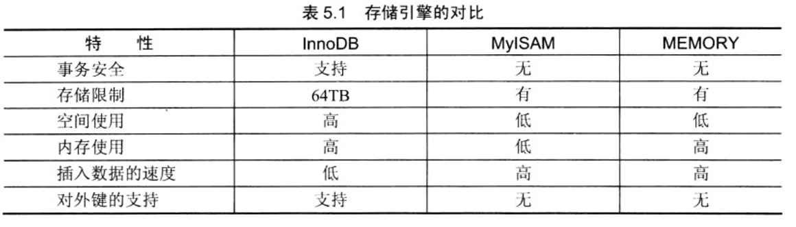
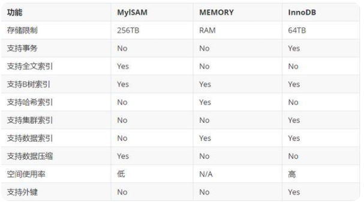
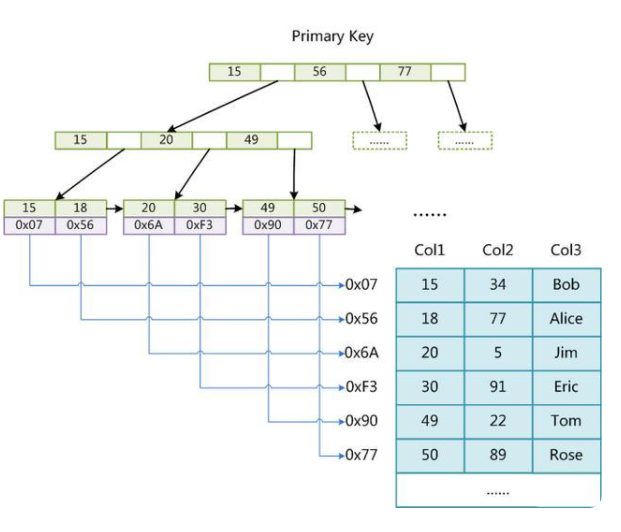

# MySQL引擎
- [参考链接1](https://www.cnblogs.com/yuxiuyan/p/6511837.html)

## 引擎介绍
引擎（Engine）是电子平台上开发程序或系统的核心组件。利用引擎，开发者可迅速建立、
铺设程序所需的功能，或利用其辅助程序的运转。一般而言，引擎是一个程序或一套系统的支持部分。常见的程序引擎有游戏引擎，搜索引擎，杀毒引擎等。

简单来说，**存储引擎就是指表的类型以及表在计算机上的存储方式。**

存储引擎的概念是MySQL的特点，Oracle中没有专门的存储引擎的概念，Oracle有OLTP和OLAP模式的区分。不同的存储引擎决定了MySQL数据库中的表可以用不同的方式来存储。
我们可以根据数据的特点来选择不同的存储引擎。

在MySQL中的存储引擎有很多种，可以通过“SHOW ENGINES”语句来查看。下
面重点关注InnoDB、MyISAM、MEMORY这三种。

## InnoDB
InnoDB给MySQL的表提供了**事务处理、回滚、崩溃修复能力和多版本并发控制的事务安全。**
在MySQL从3.23.34a开始包含InnnoDB。
它是MySQL上第一个提供外键约束的表引擎。而且InnoDB对事务处理的能力，也是其他存储引擎不能比拟的。
靠后版本的MySQL的默认存储引擎就是InnoDB。

InnoDB存储引擎总支持**AUTO_INCREMENT。**
自动增长列的值不能为空，并且值必须唯一。
MySQL中规定自增列必须为主键。
在插入值的时候，如果自动增长列不输入值，则插入的值为自动增长后的值；
如果输入的值为0或空（NULL），则插入的值也是自动增长后的值；
如果插入某个确定的值，且该值在前面没有出现过，就可以直接插入。

InnoDB还支持外键（FOREIGN KEY）。
外键所在的表叫做子表，外键所依赖（REFERENCES）的表叫做父表。
父表中被字表外键关联的字段必须为主键。
当删除、更新父表中的某条信息时，子表也必须有相应的改变，这是数据库的参照完整性规则。

InnoDB中，创建的表的表结构存储在.frm文件中（我觉得是frame的缩写吧）。
数据和索引存储在innodb_data_home_dir和innodb_data_file_path定义的表空间中。

InnoDB的优势在于提供了良好的事务处理、崩溃修复能力和并发控制。
缺点是读写效率较差，占用的数据空间相对较大。

## MyISAM
MyISAM是MySQL中常见的存储引擎，曾经是MySQL的默认存储引擎。
MyISAM是基于ISAM引擎发展起来的，增加了许多有用的扩展。

MyISAM的表存储成3个文件。文件的名字与表名相同。拓展名为frm、MYD、MYI。
其实，frm文件存储表的结构；MYD文件存储数据，是MYData的缩写；
MYI文件存储索引，是MYIndex的缩写。

基于MyISAM存储引擎的表支持3种不同的存储格式。包括静态型、动态型和压缩型。
其中，静态型是MyISAM的默认存储格式，它的字段是固定长度的；
动态型包含变长字段，记录的长度不是固定的；
压缩型需要用到myisampack工具，占用的磁盘空间较小。

## MEMORY
MEMORY是MySQL中一类特殊的存储引擎。它使用存储在内存中的内容来创建表，而且**数据全部放在内存中**。
这些特性与前面的两个很不同。

每个基于MEMORY存储引擎的表实际对应一个磁盘文件。
该文件的文件名与表名相同，类型为frm类型。该文件中只存储表的结构。
而其数据文件，都是存储在内存中，这样有利于数据的快速处理，提高整个表的效率。
值得注意的是，服务器需要有足够的内存来维持MEMORY存储引擎的表的使用。如果不需要了，可以释放内存，甚至删除不需要的表。

MEMORY默认使用哈希索引。速度比使用B型树索引快。当然如果你想用B型树索引，可以在创建索引时指定。

注意，MEMORY用到的很少，因为它是把数据存到内存中，如果内存出现异常就会影响数据。
如果重启或者关机，所有数据都会消失。因此，基于MEMORY的表的生命周期很短，一般是一次性的。

## 怎样选择存储引擎

在实际工作中，选择一个合适的存储引擎是一个比较复杂的问题。每种存储引擎都有自己的优缺点，不能笼统地说谁比谁好。
### 1. 对比1
- [参考链接](https://www.cnblogs.com/yuxiuyan/p/6511837.html)

**InnoDB**：支持事务处理，支持外键，支持崩溃修复能力和并发控制。
如果需要对事务的完整性要求比较高（比如银行），要求实现并发控制（比如售票），
那选择InnoDB有很大的优势。
如果需要频繁的更新、删除操作的数据库，也可以选择InnoDB，
因为支持事务的提交（commit）和回滚（rollback）。 

**MyISAM**：插入数据快，空间和内存使用比较低。
如果表主要是用于插入新记录和读出记录，那么选择MyISAM能实现处理高效率。
如果应用的完整性、并发性要求比 较低，也可以使用。

MEMORY：所有的数据都在内存中，数据的处理速度快，但是安全性不高。
如果需要很快的读写速度，对数据的安全性要求较低，可以选择MEMOEY。
它对表的大小有要求，不能建立太大的表。所以，这类数据库只使用在相对较小的数据库表。

注意，同一个数据库也可以使用多种存储引擎的表。
如果一个表要求比较高的事务处理，可以选择InnoDB。这个数据库中可以将查询要求比较高的表选择MyISAM存储。如果该数据库需要一个用于查询的临时表，可以选择MEMORY存储引擎。

### 2. 对比2
- [参考链接2](https://baijiahao.baidu.com/s?id=1655327558614401593&wfr=spider&for=pc)

#### 1. MyISAM

使用这个存储引擎，每个MyISAM在磁盘上存储成三个文件。

    
    （1）frm文件：存储表的定义数据
    （2）MYD文件：存放表具体记录的数据
    （3）MYI文件：存储索引

frm和MYI可以存放在不同的目录下。
MYI文件用来存储索引，但仅保存记录所在页的指针，
索引的结构是B+树结构。下面这张图就是MYI文件保存的机制：

从这张图可以发现，这个存储引擎通过MYI的B+树结构来查找记录页，再根据记录页查找记录。
并且支持全文索引、B树索引和数据压缩。

支持数据的类型也有三种：

（1）静态固定长度表

这种方式的优点在于存储速度非常快，容易发生缓存，而且表发生损坏后也容易修复。缺点是占空间。这也是默认的存储格式。

（2）动态可变长表

优点是节省空间，但是一旦出错恢复起来比较麻烦。

（3）压缩表

上面说到支持数据压缩，说明肯定也支持这个格式。在数据文件发生错误时候，可以使用check table工具来检查，而且还可以使用repair table工具来恢复。

有一个重要的特点那就是不支持事务，但是这也意味着他的存储速度更快，如果你的读写操作允许有错误数据的话，只是追求速度，可以选择这个存储引擎

#### 2. InnoDB
InnoDB是默认的数据库存储引擎，他的主要特点有：

（1）可以通过自动增长列，方法是auto_increment。

（2）支持事务。默认的事务隔离级别为可重复读，通过MVCC（并发版本控制）来实现的。

（3）使用的锁粒度为行级锁，可以支持更高的并发；

（4）支持外键约束；外键约束其实降低了表的查询速度，但是增加了表之间的耦合度。

（5）配合一些热备工具可以支持在线热备份；

（6）在InnoDB中存在着缓冲管理，通过缓冲池，将索引和数据全部缓存起来，加快查询的速度；

（7）对于InnoDB类型的表，其数据的物理组织形式是聚簇表。
所有的数据按照主键来组织。数据和索引放在一块，都位于B+数的叶子节点上；

当然InnoDB的存储表和索引也有下面两种形式：

（1）使用共享表空间存储：所有的表和索引存放在同一个表空间中。

（2）使用多表空间存储：表结构放在frm文件，数据和索引放在IBD文件中。
分区表的话，每个分区对应单独的IBD文件，分区表的定义可以查看我的其他文章。使用分区表的好处在于提升查询效率。

对于InnoDB来说，最大的特点在于支持事务。但是这是以损失效率来换取的。

**为什么InnoDB表必须要有主键，并且推荐使用整型的自增元素？
因为InnoDB中 需要按照 主键来维护索引，而这个主键 使用 整型来表示的话 
肯定比用字符来表示时 查找效率高（整型数字比较当然快啊，字符串比较还要一个一个字符转为ASCII码在比较）。
使用 自增元素的话，当 新增数据的时候，不需要再已经有序的 节点序列中间插入，这样效率就会很差，
自增的话直接在最后增加就可以了，这样 索引就非常好维护。

#### 3. MEMORY
将数据存在内存，为了提高数据的访问速度，每一个表实际上和一个磁盘文件关联。文件是frm。

（1）支持的数据类型有限制，比如：不支持TEXT和BLOB类型，对于字符串类型的数据，只支持固定长度的行，VARCHAR会被自动存储为CHAR类型；

（2）支持的锁粒度为表级锁。所以，在访问量比较大时，表级锁会成为MEMORY存储引擎的瓶颈；

（3）由于数据是存放在内存中，一旦服务器出现故障，数据都会丢失；

（4）查询的时候，如果有用到临时表，而且临时表中有BLOB，TEXT类型的字段，那么这个临时表就会转化为MyISAM类型的表，性能会急剧降低；

（5）默认使用hash索引。

（6）如果一个内部表很大，会转化为磁盘表。

在这里只是给出3个常见的存储引擎。使用哪一种引擎需要灵活选择，一个数据库中多个表可以使用不同引擎以满足各种性能和实际需求，
使用合适的存储引擎，将会提高整个数据库的性能

## InnoDB和MyISAM的区别

1. InnoDB支持事务，MyISAM不支持事务。

2. InnoDB支持外键，而MyISAM不支持外键。对一个包含外键的InnoDB表转为MyISAM会失败。

3. InnoDB是聚集索引，MyISAM是非聚集索引。

    - 聚簇索引的文件存放在主键索引的叶子节点上，因此 InnoDB 必须要有主键，通过主键索引效率很高。
    - 但是辅助索引需要两次查询，先查询到主键，然后再通过主键查询到数据。因此，主键不应该过大，因为主键太大，其他索引也都会很大。
    - 而 MyISAM 是非聚集索引，数据文件是分离的，索引保存的是数据文件的指针。主键索引和辅助索引是独立的。

4. InnoDB 不保存表的具体行数，执行 select count(*) from table 时需要全表扫描。而MyISAM 用一个变量保存了整个表的行数，执行上述语句时只需要读出该变量即可，速度很快；

5. InnoDB 最小的锁粒度是行锁，MyISAM 最小的锁粒度是表锁。一个更新语句会锁住整张表，导致其他查询和更新都会被阻塞，因此并发访问受限。这也是 MySQL 将默认存储引擎从 MyISAM 变成 InnoDB 的重要原因之一；

## 如何选择
1. 是否要支持事务，如果要请选择 InnoDB，如果不需要可以考虑 MyISAM；
2. 如果表中绝大多数都只是读查询，可以考虑 MyISAM，如果既有读写也挺频繁，请使用InnoDB。
3. 系统奔溃后，MyISAM恢复起来更困难，能否接受，不能接受就选 InnoDB；
4. MySQL5.5版本开始Innodb已经成为Mysql的默认引擎(之前是MyISAM)，说明其优势是有目共睹的。如果你不知道用什么存储引擎，那就用InnoDB，至少不会差。

