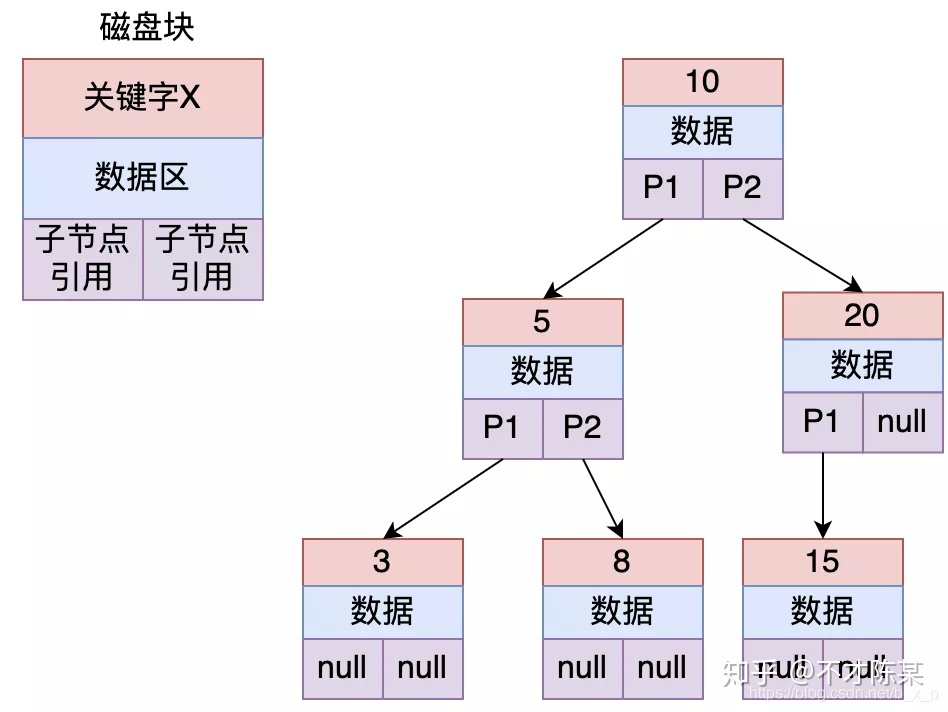
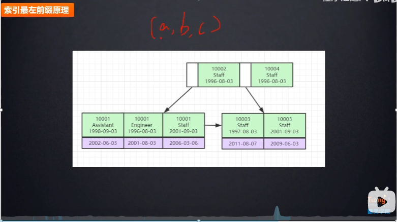
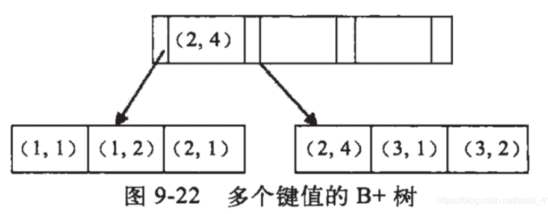

# MySql索引
- [参考](https://zhuanlan.zhihu.com/p/29118331)

## 什么是索引
一个索引是存储的表中一个特定列的值数据结构（最常见的是B-Tree）。
索引是在表的列上创建。所以，要记住的关键点是索引包含一个表中列的值，
并且这些值存储在一个数据结构中。请记住记住这一点：索引是一种数据结构 。

## 索引存储类型
### 什么样的数据结构可以作为索引？
B-Tree 是最常用的用于索引的数据结构。因为它们是时间复杂度低， 查找、删除、插入操作都可以可以在对数时间内完成。
另外一个重要原因存储在B-Tree中的数据是有序的。
数据库管理系统（RDBMS）通常决定索引应该用哪些数据结构。
但是，在某些情况下，你在创建索引时可以指定索引要使用的数据结构。

### 为什么不使用哈希索引
哈希表是另外一种你可能看到用作索引的数据结构-这些索引通常被称为哈希索引。
使用哈希索引的原因是，在寻找值时哈希表效率极高。
所以，如果使用哈希索引，对于比较字符串是否相等的查询能够极快的检索出的值。

缺点：
哈希表是无顺的数据结构，对于很多类型的查询语句哈希索引都无能为力。举例来说，假如你想要找出所有小于40岁的员工。
你怎么使用使用哈希索引进行查询？这不可行，因为哈希表只适合查询键值对-也就是说查询相等的查询.
哈希表的键值映射也暗示其键的存储是无序的。
这就是为什么哈希索引通常不是数据库索引的默认数据结构-因为在作为索引的数据结构时，其不像B-Tree那么灵活

### 为什么不使用二叉查找树 作为索引
二叉树的查找时间复杂度可以达到O(log2(n))，
二叉树搜索相当于一个二分查找。二叉查找能大大提升查询的效率，但是它有一个问题，如果插入的节点是有序的，
那么带索引就会变为一个 线性链表结构，此时查找就变为了全表扫描，效率很差

### 为什么不使用平衡二叉树

如果上图中平衡二叉树保存的是id索引，现在要查找id = 8的数据，过程如下：

1. 把根节点加载进内存，用8和10进行比较，发现8比10小，继续加载10的左子树。
2. 把5加载进内存，用8和5比较，同理，加载5节点的右子树。
3. 此时发现命中，则读取id为8的索引对应的数据。

索引保存数据的方式一般有两种：
1. 数据区保存id 对应行数据的所有数据具体内容。
2. 数据区保存的是真正保存数据的磁盘地址。

平衡二叉树解决了 二叉查找树存在的 线性链表的问题，但是它也存在一些问题：

1. 搜索效率不足。一般来说，在树结构中，数据所处的深度，决定了搜索时的IO次数（MySql中将每个节点大小设置为一页大小，
一次IO读取一页 / 一个节点）。如上图中搜索id = 8的数据，需要进行3次IO。
当数据量到达几百万的时候，树的高度就会很恐怖。

2. 查询不不稳定。如果查询的数据落在根节点，只需要一次IO，如果是叶子节点或者是支节点，会需要多次IO才可以。

3. 存储的数据内容太少。没有很好利用操作系统和磁盘数据交换特性，也没有利用好磁盘IO的预读能力。
因为操作系统和磁盘之间一次数据交换是以页为单位的，一页大小为 4K，即每次IO操作系统会将4K数据加载进内存。
但是，在二叉树每个节点的结构只保存一个关键字，一个数据区，两个子节点的引用，
并不能够填满4K的内容。幸幸苦苦做了一次的IO操作，却只加载了一个关键字。
在树的高度很高，恰好又搜索的关键字位于叶子节点或者支节点的时候，取一个关键字要做很多次的IO。

那有没有一种结构能够解决二叉树的这种问题呢？有，那就是多路平衡查找树。

### 多路平衡查找树(Balance Tree)
B-Tree 是一个绝对平衡树，所有的叶子节点在同一高度。

B+ 树与B树的区别在于非叶子节点不存放数据，只存放keys。
并且叶子节点之间存在指针相连，而且是单链表。

因此，B+树的非叶子节点可以包含更多的索引，从而树的高度降低，减少索引时IO的次数。

## 索引的优缺点

### 优点
- 索引大大减小了服务器需要扫描的数据量
- 索引可以帮助服务器避免排序和临时表
- 索引可以将随机IO变成顺序IO
- 索引对于InnoDB（对索引支持行级锁）非常重要，因为它可以让查询锁更少的元组。

    在MySQL5.1和更新的版本中，InnoDB可以在服务器端过滤掉行后就释放锁，但在早期的MySQL版本中，InnoDB直到事务提交时才会解锁。对不需要的元组的加锁，会增加锁的开销，降低并发性。  
    InnoDB仅对需要访问的元组加锁，而索引能够减少InnoDB访问的元组数。但是只有在存储引擎层过滤掉那些不需要的数据才能达到这种目的。  
    一旦索引不允许InnoDB那样做（即索引达不到过滤的目的），MySQL服务器只能对InnoDB返回的数据进行WHERE操作，此时，已经无法避免对那些元组加锁了。  
    如果查询不能使用索引，MySQL会进行全表扫描，并锁住每一个元组，不管是否真正需要。

- 关于InnoDB、索引和锁：InnoDB在二级索引上使用共享锁（读锁），但访问主键索引需要排他锁（写锁）

### 缺点
- 虽然索引大大提高了查询速度，同时却会降低更新表的速度，如对表进行INSERT、UPDATE和DELETE。因为更新表时，MySQL不仅要保存数据，还要保存索引文件。

- 建立索引会占用磁盘空间的索引文件。一般情况这个问题不太严重，但如果你在一个大表上创建了多种组合索引，索引文件的会膨胀很快。

- 如果某个数据列包含许多重复的内容，为它建立索引就没有太大的实际效果。

- 对于非常小的表，大部分情况下简单的全表扫描更高效；

索引只是提高效率的一个因素，如果你的MySQL有大数据量的表，就需要花时间研究建立最优秀的索引，或优化查询语句。

因此应该只为最经常查询和最经常排序的数据列建立索引。

MySQL里同一个数据表里的索引总数限制为16个。

### B-Tree索引

- InnoDB使用的是B+Tree

- B+Tree：每一个叶子节点都包含指向下一个叶子节点的指针，从而方便叶子节点的范围遍历。

- B-Tree通常意味着所有的值都是按顺序存储的，并且每一个叶子页到根的距离相同，很适合查找范围数据。

- B-Tree可以对<，<=，=，>，>=，BETWEEN，IN，以及不以通配符开始的LIKE使用索引。

### 索引查询

- 可以利用B-Tree索引进行全关键字、关键字范围和关键字前缀查询，
但必须保证按索引的最左边前缀(leftmost prefix of the index)来进行查询。

- 按索引的最左边前缀(leftmost prefix of the index)来进行查询：

## 聚集索引和非聚集索引

MyISAM中索引和数据是分开存储的，即查找索引文件MYI文件，然后找MYD数据文件，所以是非聚集索引。

而InnoDB中 索引和数据是存在一起的，即都是存在ibd文件中，数据本身存在在索引结构中，所以是聚集索引。

## 联合索引

其的底层存储结构长什么样子：

即索引节点中，按照（a b c）的顺序进行存储和比较。

例如：

可以看到a的值是有顺序的，1，1，2，2，3，3，而b的值是没有顺序的1，2，1，4，1，2。
所以b = 2这种查询条件没有办法利用索引，因为联合索引首先是按a排序的，b是无序的。

同时我们还可以发现在a值相等的情况下，b值又是按顺序排列的，但是这种顺序是相对的。
所以最左匹配原则遇上范围查询就会停止，剩下的字段都无法使用索引。
例如a = 1 and b = 2 a,b字段都可以使用索引，因为在a值确定的情况下b是相对有序的，
而a>1and b=2，a字段可以匹配上索引，但b值不可以，因为a的值是一个范围，在这个范围中b是无序的。

**最左匹配原则：最左优先，以最左边的为起点任何连续的索引都能匹配上。
同时遇到范围查询(>、<、between、like)就会停止匹配。**

### 为什么会失效？
因为 联合索引中 会按照第一个索引元素是有序的，但是其他索引元素就相对是无序的。
并且 在B+树中的 非叶节点上，直接看其他非最左索引元素也是无序的，所以没有办法使用索引。 

模糊查找（like %）同理，需要前缀才能找到。

## 二级索引（辅助索引）
- [参考链接](https://www.cnblogs.com/gaoquanquan/p/11030999.html)

二级索引：叶子节点中存储主键值，每次查找数据时，根据索引找到叶子节点中的主键值，
根据主键值再到聚簇索引中得到完整的一行记录。

问题：

1. 相比于叶子节点中存储行指针，二级索引存储主键值会占用更多的空间，那为什么要这样设计呢？
> InnoDB在移动行时，无需维护二级索引，因为叶子节点中存储的是主键值，而不是指针。

2. 那么InnoDB有了聚簇索引，为什么还要有二级索引呢？
> 聚簇索引的叶子节点存储了一行完整的数据，而二级索引只存储了主键值，相比于聚簇索引，占用的空间要少。
> 当我们需要为表建立多个索引时，如果都是聚簇索引，那将占用大量内存空间，所以InnoDB中主键所建立的是聚簇索引，而唯一索引、普通索引、前缀索引等都是二级索引。

3. 为什么一般情况下，我们建表的时候都会使用一个自增的id来作为我们的主键？
> InnoDB中表中的数据是直接存储在主键聚簇索引的叶子节点中的，每插入一条记录，其实都是增加一个叶子节点，如果主键是顺序的，
> 只需要把新增的一条记录存储在上一条记录的后面，当页达到最大填充因子的时候，下一跳记录就会写入新的页中，这种情况下，主键页就会近似于被顺序的记录填满。
  
> 若表的主键不是顺序的id，而是无规律数据，比如字符串，InnoDB无法加单的把一行记录插入到索引的最后，而是需要找一个合适的位置（已有数据的中间位置），
> 甚至产生大量的页分裂并且移动大量数据，在寻找合适位置进行插入时，目标页可能不在内存中，这就导致了大量的随机IO操作，影响插入效率。除此之外，大量的页分裂会导致大量的内存碎片。  

普通索引允许被索引的数据列包含重复的值。 普通索引的唯一任务是加快对数据的访问速度。
因此，应该只为那些最经常出现在查询条件（WHERE column = ）或排序条件（ORDER BY column）中
的数据列创建索引。只要有可能，就应该选择一个数据最整齐、最紧凑的数据列（如一个整数类型的数据列）来创建索引。

主键一定是唯一性索引。
但是一张表中可以有多个唯一性索引，所以唯一性索引不一定是主键。
事实上，在许多场合，人们创建唯一索引的目的往往不是为了提高访问速度，而只是为了避免数据出现重复。

### 回表
所谓的回表查询，先定位主键值，再定位行记录，它的性能较扫一遍索引树更低。
例如，先通过普通索引查找到主键的值，然后使用聚集索引（主键索引）找到这个主键值，从而得到
其他的数据，因此该方式需要找两次索引。

### 覆盖索引
覆盖索引是select的数据列只用从索引中就能够取得，不必读取数据行，换句话说查询列要被所建的索引覆盖。

理解1：
索引是高效找到行的一个方法，但是一般数据库也能使用索引找到一个列的数据，因此它不必读取整个行。
毕竟索引叶子节点存储了它们索引的数据；当能通过读取索引就可以得到想要的数据，那就不需要读取行了。
一个索引包含了（或覆盖了）满足查询结果的数据就叫做覆盖索引。

理解2：
是非聚集复合索引的一种形式，它包括在查询里的Select、Join和Where子句用到的所有列（即建索引的字段正好是覆盖查询条件中所涉及的字段，
也即，索引包含了查询正在查找的数据）。

如果你想要通过索引覆盖select多列，那么需要给需要的列建立一个多列索引，
当然如果带查询条件，where条件要求满足最左前缀原则。

### 全文索引
> [参考链接](https://zhuanlan.zhihu.com/p/88275060)

全文索引,通过建立倒排索引,可以极大的提升检索效率,解决判断字段是否包含的问题. 
例如: 有title字段,需要查询所有包含 "政府"的记录. 
需要 like "%政府%"方式查询,查询速度慢,当查询包含"政府" OR "中国"的需要时,sql难以简单满足.
全文索引就可以实现这个功能.
> 倒排索引（英语：Inverted index），也常被称为反向索引、置入档案或反向档案，是一种索引方法，
>被用来存储在全文搜索下某个单词在一个文档或者一组文档中的存储位置的映射。
>它是文档检索系统中最常用的数据结构。

注意：
在MySQL 5.6版本以前,只有MyISAM存储引擎支持全文引擎.在5.6版本中,InnoDB加入了对全文索引的支持,
但是不支持中文全文索引.在5.7.6版本,MySQL内置了ngram全文解析器,用来支持亚洲语种的分词.