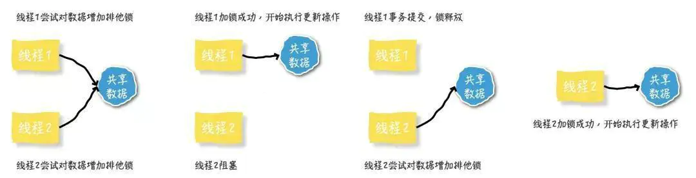
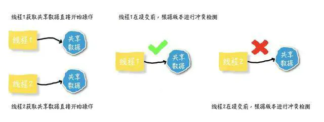
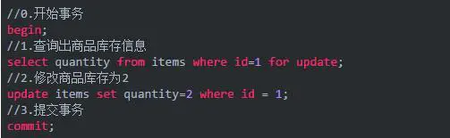

# 数据库的隔离级别
- [参考](https://www.cnblogs.com/myseries/p/10748912.html)
- 事务的隔离级别有四种，由低到高分别是：

    Read uncommitted(读未提交)
    
    Read committed(读已提交)

    Repeatable read(可重复读)

    Serializable(序列化)

## 脏读、不可重复读、幻象
**脏读、不可重复读、幻象读概念说明：**
- 脏读：指当一个事务正在访问数据，并且对数据进行了修改，而这种数据还没有提交到数据库中，这时，另外一个事务也访问这个数据，然后使用了这个数据。  
因为这个数据还没有提交那么另外一个事务读取到的这个数据我们称之为脏数据。依据脏数据所做的操作肯能是不正确的。  
　　
- 不可重复读：指在一个事务内，多次读同一数据。在这个事务还没有执行结束，另外一个事务也访问该同一数据，那么在第一个事务中的两次读取数据之间，由于第二个事务的修改第一个事务两次读到的数据可能是不一样的，这样就发生了在一个事物内两次连续读到的数据是不一样的，这种情况被称为是不可重复读。
   
- 幻读：一个事务先后读取一个范围的记录，但两次读取的纪录数不同，我们称之为幻象读（两次执行同一条 select 语句会出现不同的结果，第二次读会增加一数据行，并没有说这两次执行是在同一个事务中）

小结：不可重复读的和幻读很容易混淆，不可重复读侧重于修改，幻读侧重于新增或删除。解决不可重复读的问题只需锁住满足条件的行，解决幻读需要锁表。

## 隔离等级

**1. 读未提交(Read uncommitted)**

- 读未提交，顾名思义，就是一个事务可以读取另一个未提交事务的数据。
- 事例：老板要给程序员发工资，程序员的工资是3.6万/月。但是发工资时老板不小心按错了数字，按成3.9万/月，该钱已经打到程序员的户口，但是事务还没有提交，就在这时，程序员去查看自己这个月的工资，发现比往常多了3千元，以为涨工资了非常高兴。但是老板及时发现了不对，马上回滚差点就提交了的事务，将数字改成3.6万再提交。

- 分析：实际程序员这个月的工资还是3.6万，但是程序员看到的是3.9万。他看到的是老板还没提交事务时的数据。这就是脏读。因此，在这种隔离级别下，查询是不会加锁的，也由于查询的不加锁，所以这种隔离级别的一致性是最差的，可能会产生“脏读”、“不可重复读”、“幻读”。如无特殊情况，基本是不会使用这种隔离级别的。

- 那怎么解决脏读呢？Read committed！读提交，能解决脏读问题。

**2. 读提交(Read Committed)**
- 读提交，顾名思义，就是只能读到已经提交了的内容
- 事例：程序员拿着信用卡去享受生活（卡里当然是只有3.6万），当他埋单时（程序员事务开启），收费系统事先检测到他的卡里有3.6万，就在这个时候！！程序员的妻子要把钱全部转出充当家用，并提交。  
当收费系统准备扣款时，再检测卡里的金额，发现已经没钱了（第二次检测金额当然要等待妻子转出金额事务提交完）。程序员就会很郁闷，明明卡里是有钱的…

- 分析：这就是读提交，若有事务对数据进行更新（UPDATE）操作时，读操作事务要等待这个更新操作事务提交后才能读取数据，可以解决脏读问题。但在这个事例中，出现了**一个事务范围内两个相同的查询却返回了不同数据，这就是不可重复读**

- 这是各种系统中最常用的一种隔离级别，也是SQL Server和Oracle的默认隔离级别。这种隔离级别能够有效的避免脏读，但除非在查询中显示的加锁,不然，普通的查询是不会加锁的。

**3. 可重复读(Repeated Read)**
- 可重复读，顾名思义，就是专门针对“不可重复读”这种情况而制定的隔离级别，自然，它就可以有效的避免“不可重复读”。而它也是MySql的默认隔离级别。
即在数据读出来之后加锁，防止别人修改它。

- 事例：程序员拿着信用卡去享受生活（卡里当然是只有3.6万），当他埋单时（事务开启，不允许其他事务的UPDATE修改操作），收费系统事先检测到他的卡里有3.6万。  
这个时候他的妻子不能转出金额了。接下来收费系统就可以扣款了。
- 分析：重复读可以解决不可重复读问题。  
写到这里，应该明白的一点就是，**不可重复读对应的是修改，即UPDATE操作。但是可能还会有幻读问题。因为幻读问题对应的是插入INSERT操作，而不是UPDATE操作。**

**什么时候会出现幻读？**

- 事例：程序员某一天去消费，花了2千元，然后他的妻子去查看他今天的消费记录（全表扫描FTS，妻子事务开启），看到确实是花了2千元，就在这个时候，程序员花了1万买了一部电脑，即新增INSERT了一条消费记录，并提交。当妻子打印程序员的消费记录清单时（妻子事务提交），发现花了1.2万元，似乎出现了幻觉，这就是幻读。
- 在这个级别下，普通的查询同样是使用的“快照读”，但是，和“读提交”不同的是，当事务启动时，就不允许进行“修改操作（Update）”了，而“不可重复读”恰恰是因为两次读取之间进行了数据的修改，因此，“可重复读”能够有效的避免“不可重复读”，但却避免不了“幻读”，因为幻读是由于“插入或者删除操作（Insert or Delete）”而产生的。

- 那怎么解决幻读问题？Serializable！

**4. 序列化 Serializable**
- 这是数据库最高的隔离级别，这种级别下，事务“串行化顺序执行”，也就是一个一个排队执行。这种级别下，“脏读”、“不可重复读”、“幻读”都可以被避免，但是执行效率奇差，性能开销也最大，所以基本没人会用。

**值得一提的是：大多数数据库默认的事务隔离级别是Read committed，比如Sql Server , Oracle。Mysql的默认隔离级别是Repeatable read。**

***

## 补充

MySQL中默认事务隔离级别是“可重复读”时并不会锁住读取到的行。

**事务隔离级别：读已提交，写数据只会锁住相应的行。**

**事务隔离级别为：可重复读时，写数据会锁住整张表。**

**事务隔离级别为：串行化时，读写数据都会锁住整张表。**

隔离级别越高，越能保证数据的完整性和一致性，但是对并发性能的影响也越大，鱼和熊掌不可兼得啊。对于多数应用程序，可以优先考虑把数据库系统的隔离级别设为Read Committed，它能够避免脏读取，而且具有较好的并发性能。尽管它会导致不可重复读、幻读这些并发问题，
在可能出现这类问题的个别场合，可以由应用程序采用悲观锁或乐观锁来控制。

## 悲观锁和乐观锁
- [参考链接](https://www.jianshu.com/p/d2ac26ca6525)

### 一 并发控制
当程序中可能出现并发的情况时，就需要保证在并发情况下数据的准确性，
以此确保当前用户和其他用户一起操作时，所得到的结果和他单独操作时的结果是一样的。
这种手段就叫做并发控制。并发控制的目的是保证一个用户的工作不会对另一个用户的工作产生不合理的影响。

常说的并发控制，一般都和数据库管理系统(DBMS)有关。在 DBMS 中的并发控制的任务，
是确保在多个事务同时存取数据库中同一数据时，不破坏事务的隔离性、一致性和数据库的统一性。

**实现并发控制的主要手段大致可以分为乐观并发控制和悲观并发控制两种。**

首先要明确：无论是悲观锁还是乐观锁，都是人们定义出来的概念，可以认为是一种思想。
其实不仅仅是关系型数据库系统中有乐观锁和悲观锁的概念，
像 hibernate、tair、memcache 等都有类似的概念。
所以，不应该拿乐观锁、悲观锁和其他的数据库锁等进行对比。
**乐观锁比较适用于读多写少的情况(多读场景)，悲观锁比较适用于写多读少的情况(多写场景)。**

### 二 悲观锁(Pessimistic Lock)

#### 1. 理解
当要对数据库中的一条数据进行修改的时候，为了避免同时被其他人修改，
最好的办法就是直接对该数据进行加锁以防止并发。
这种借助数据库锁机制，在修改数据之前先锁定，再修改的方式被称之为
悲观并发控制【Pessimistic Concurrency Control，缩写“PCC”，又名“悲观锁”】。

悲观锁，正如其名，具有强烈的独占和排他特性。
它指的是对数据被外界(包括本系统当前的其他事务，以及来自外部系统的事务处理)修改持保守态度。
因此，在整个数据处理过程中，将数据处于锁定状态。
悲观锁的实现，往往依靠数据库提供的锁机制(也只有数据库层提供的锁机制才能真正保证数据访问的排他性，
否则，即使在本系统中实现了加锁机制，也无法保证外部系统不会修改数据)。

之所以叫做悲观锁，是因为这是一种对数据的修改持有悲观态度的并发控制方式。
总是假设最坏的情况，每次读取数据的时候都默认其他线程会更改数据，
因此需要进行加锁操作，当其他线程想要访问数据时，都需要阻塞挂起。

悲观锁的实现：
    
    1. 传统的关系型数据库使用这种锁机制，比如行锁，表锁等，读锁，写锁等，都是在做操作之前先上锁。
    2. Java 里面的同步 synchronized 关键字的实现。
    
 

#### 2. 悲观锁主要分为共享锁和排他锁

1. 共享锁【shared locks】又称为读锁，简称S锁。顾名思义，
共享锁就是多个事务对于同一数据可以共享一把锁，都能访问到数据，但是只能读不能修改。

2. 排他锁【exclusive locks】又称为写锁，简称X锁。顾名思义，
排他锁就是不能与其他锁并存，如果一个事务获取了一个数据行的排他锁，
其他事务就不能再获取该行的其他锁，包括共享锁和排他锁，但是获取排他锁的事务是可以对数据行读取和修改。

#### 3. 说明
悲观并发控制实际上是“先取锁再访问”的保守策略，为数据处理的安全提供了保证。
但是在效率方面，处理加锁的机制会让数据库产生额外的开销，还有增加产生死锁的机会。
另外还会降低并行性，一个事务如果锁定了某行数据，其他事务就必须等待该事务处理完才可以处理那行数据。

### 三 乐观锁(Optimistic Locking)

#### 1. 理解 
观锁是相对悲观锁而言的，乐观锁假设数据一般情况下不会造成冲突，
所以在数据进行提交更新的时候，才会正式对数据的冲突与否进行检测，
如果发现冲突了，则返回给用户错误的信息，让用户决定如何去做。
乐观锁适用于读操作多的场景，这样可以提高程序的吞吐量。

乐观锁机制采取了更加宽松的加锁机制。乐观锁是相对悲观锁而言，
也是为了避免数据库幻读、业务处理时间过长等原因引起数据处理错误的一种机制，
但乐观锁不会刻意使用数据库本身的锁机制，而是依据数据本身来保证数据的正确性。

乐观锁的实现：

    1. CAS 实现：Java 中java.util.concurrent.atomic包下面的原子变量
    使用了乐观锁的一种 CAS 实现方式。
    
    2. 版本号控制：一般是在数据表中加上一个数据版本号 version 字段，表示数据被修改的次数。
    当数据被修改时，version 值会+1。当线程A要更新数据值时，
    在读取数据的同时也会读取 version 值，在提交更新时，
    若刚才读取到的 version 值与当前数据库中的 version 值相等时才更新，
    否则重试更新操作，直到更新成功。

#### 2. 说明
乐观并发控制相信事务之间的数据竞争(data race)的概率是比较小的，
因此尽可能直接做下去，直到提交的时候才去锁定，所以不会产生任何锁和死锁。

### 四 具体实现
#### 1. 悲观锁的实现方式
悲观锁的实现，往往依靠数据库提供的锁机制。在数据库中，悲观锁的流程如下：

    1. 在对记录进行修改前，先尝试为该记录加上排他锁(exclusive locks)。
    
    2. 如果加锁失败，说明该记录正在被修改，那么当前查询可能要等待或者抛出异常。具体响应方式由开发者根据实际需要决定。
    
    3. 如果成功加锁，那么就可以对记录做修改，事务完成后就会解锁了。

    4. 期间如果有其他对该记录做修改或加排他锁的操作，都会等待解锁或直接抛出异常。
    
拿比较常用的 MySql Innodb 引擎举例，来说明一下在 SQL 中如何使用悲观锁。

要使用悲观锁，必须关闭 MySQL 数据库的自动提交属性。因为 MySQL 默认使用 autocommit 模式，
也就是说，当执行一个更新操作后，MySQL 会立刻将结果进行提交。(sql语句：set autocommit=0)

以电商下单扣减库存的过程说明一下悲观锁的使用：

以上，在对id = 1的记录修改前，先通过 for update 的方式进行加锁，然后再进行修改。这就是比较典型的悲观锁策略。

如果以上修改库存的代码发生并发，同一时间只有一个线程可以开启事务并获得id=1的锁，
其它的事务必须等本次事务提交之后才能执行。这样可以保证当前的数据不会被其它事务修改。

**注意：**上面提到，使用 select…for update 会把数据给锁住，不过需要注意一些锁的级别，
MySQL InnoDB 默认行级锁。行级锁都是基于索引的，
如果一条 SQL 语句用不到索引是不会使用行级锁的，会使用表级锁把整张表锁住，这点需要注意。

#### 2. 乐观锁实现方式
乐观锁不需要借助数据库的锁机制。主要就是两个步骤：冲突检测和数据更新。比较典型的就是 CAS (Compare and Swap)。

CAS 即比较并交换。是解决多线程并行情况下使用锁造成性能损耗的一种机制，CAS 操作包含三个操作数——内存位置(V)、预期原值(A)和新值(B)。
如果内存位置的值(V)与预期原值(A)相匹配，那么处理器会自动将该位置值更新为新值(B)。
否则，处理器不做任何操作。无论哪种情况，它都会在 CAS 指令之前返回该位置的值。CAS 有效地说明了“我认为位置(V)应该包含值(A)。
如果包含该值，则将新值(B)放到这个位置；否则，不要更改该位置，只告诉我这个位置现在的值即可”。Java 中，
sun.misc.Unsafe 类提供了硬件级别的原子操作来实现这个 CAS。java.util.concurrent包下大量的类都使用了这个 Unsafe.java 类的 CAS 操作。

当多个线程尝试使用 CAS 同时更新同一个变量时，只有其中一个线程能更新变量的值，
而其它线程都失败，失败的线程并不会被挂起，而是被告知这次竞争中失败，并可以再次尝试。

[更多相关实现可见参考链接](https://www.jianshu.com/p/d2ac26ca6525)

## 其他补充

- [参考链接1](https://www.jianshu.com/p/163c96983ca9)

