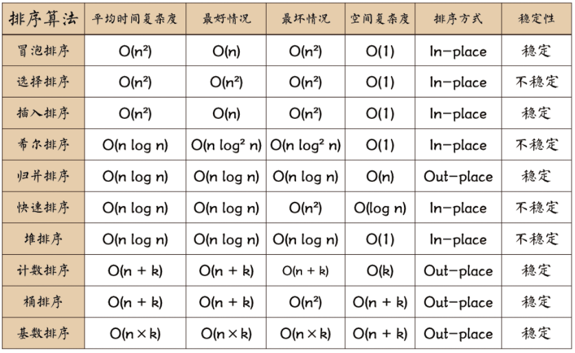
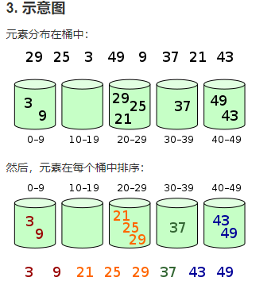

# 排序算法
- [参数链接1](https://www.runoob.com/w3cnote/ten-sorting-algorithm.html)

排序算法是《数据结构与算法》中最基本的算法之一。

排序算法可以分为内部排序和外部排序，内部排序是数据记录在内存中进行排序，
而外部排序是因排序的数据很大，一次不能容纳全部的排序记录，
在排序过程中需要访问外存。
常见的内部排序算法有：插入排序、希尔排序、选择排序、冒泡排序、归并排序、
快速排序、堆排序、基数排序等。

用一张图概括：

## 1. 冒泡排序

比较相邻的元素。如果第一个比第二个大，就交换他们两个。

对每一对相邻元素作同样的工作，从开始第一对到结尾的最后一对。这步做完后，最后的元素会是最大的数。

针对所有的元素重复以上的步骤，除了最后一个。

持续每次对越来越少的元素重复上面的步骤，直到没有任何一对数字需要比较。

> [参考链接](https://www.runoob.com/w3cnote/bubble-sort.html)

## 2. 选择排序
首先在未排序序列中找到最小（大）元素，存放到排序序列的起始位置。

再从剩余未排序元素中继续寻找最小（大）元素，然后放到已排序序列的末尾。

重复第二步，直到所有元素均排序完毕。

> [参考链接](https://www.runoob.com/w3cnote/selection-sort.html)

## 3. 插入排序
将第一待排序序列第一个元素看做一个有序序列，把第二个元素到最后一个元素当成是未排序序列。

从头到尾依次扫描未排序序列，将扫描到的每个元素插入有序序列的适当位置。
（如果待插入的元素与有序序列中的某个元素相等，则将待插入元素插入到相等元素的后面。）

> [参考链接](https://www.runoob.com/w3cnote/insertion-sort.html)

## 4. 希尔排序（shell sort）
希尔排序(Shell Sort)是插入排序的一种，它是针对直接插入排序算法的改进。

希尔排序又称缩小增量排序，因 DL.Shell 于 1959 年提出而得名.

它通过比较相距一定间隔的元素来进行，各趟比较所用的距离随着算法的进行而减小，直到只比较相邻元素的最后一趟排序为止。

希尔排序目的为了加快速度改进了插入排序，交换不相邻的元素对数组的局部进行排序，并最终用插入排序将局部有序的数组排序。

在此我们选择增量 gap=length/2，缩小增量以 gap = gap/2 的方式，用序列 {n/2,(n/2)/2...1} 来表示。

- [参考链接](https://m.runoob.com/data-structures/shell-sort.html)

## 5. 归并排序
归并排序（Merge sort）是建立在归并操作上的一种有效的排序算法。该算法是采用分治法（Divide and Conquer）的一个非常典型的应用。

- [参考链接](https://www.cnblogs.com/chengxiao/p/6194356.html)

## 6. 快速排序
快速排序使用分治法（Divide and conquer）策略来把一个串行（list）分为两个子串行（sub-lists）。

快速排序通常明显比其他 Ο(nlogn) 算法更快，快速排序的最坏运行情况是 O(n²)，比如说顺序数列的快排。
但它的平摊期望时间是 O(nlogn)，且 O(nlogn) 记号中隐含的常数因子很小，
比复杂度稳定等于 O(nlogn) 的归并排序要小很多。所以，对绝大多数顺序性较弱的随机数列而言，快速排序总是优于归并排序。

思想：
快速排序的基本思想：通过一趟排序将待排记录分隔成独立的两部分，其中一部分记录的关键字均比另一部分的关键字小，则可分别对这两部分记录继续进行排序，以达到整个序列有序。

步骤：

    1、设置两个变量 low、high，排序开始时：low=0，high=size-1。
    2、整个数组找基准正确位置，所有元素比基准值小的摆放在基准前面，所有元素比基准值大的摆在基准的后面
    
    默认数组的第一个数为基准数据，赋值给key，即key=array[low]。
    因为默认数组的第一个数为基准，所以从后面开始向前搜索（high–），找到第一个小于key的array[high]，就将 array[high] 赋给 array[low]，即 array[low] = array[high]。（循环条件是 array[high] >= key；结束时 array[high] < key）
    此时从前面开始向后搜索（low++），找到第一个大于key的array[low]，就将 array[low] 赋给 array[high]，即 array[high] = array[low]。（循环条件是 array[low] <= key；结束时 array[low] > key）
    循环 2-3 步骤，直到 low=high，该位置就是基准位置。
    把基准数据赋给当前位置。
    
    3、第一趟找到的基准位置，作为下一趟的分界点。
    4、递归调用（recursive）分界点前和分界点后的子数组排序，重复2.2、2.3、2.4的步骤。
    5、最终就会得到排序好的数组。

- [参考链接](https://blog.csdn.net/weixin_42109012/article/details/91645051)

## 7. 堆排序
堆排序（Heapsort）是指利用堆这种数据结构所设计的一种排序算法。
堆积是一个近似完全二叉树的结构，并同时满足堆积的性质：即子结点的键值或索引总是小于（或者大于）它的父节点。
堆排序可以说是一种利用堆的概念来排序的选择排序。

分为两种方法：

1. 大顶堆：每个节点的值都大于或等于其子节点的值，在堆排序算法中用于升序排列；
2. 小顶堆：每个节点的值都小于或等于其子节点的值，在堆排序算法中用于降序排列；

算法步骤：

    1. 创建一个堆 H[0……n-1]；
    
    2. 把堆首（最大值）和堆尾互换；
    
    3. 把堆的尺寸缩小 1，并调用 shift_down(0)，目的是把新的数组顶端数据调整到相应位置；
    
    4. 重复步骤 2，直到堆的尺寸为 1。
    
- [堆排序](https://www.runoob.com/w3cnote/heap-sort.html)

## 8. 计数排序
计数排序的核心在于将输入的数据值转化为键存储在额外开辟的数组空间中。
作为一种线性时间复杂度的排序，计数排序要求输入的数据必须是有确定范围的整数。
**优化版本的计数排序才属于稳定排序。**

算法的步骤如下：

    （1）找出待排序的数组中最大和最小的元素
    （2）统计数组中每个值为i的元素出现的次数，存入数组C的第i项
    （3）对所有的计数累加（从C中的第一个元素开始，每一项和前一项相加）
    （4）反向填充目标数组：将每个元素i放在新数组的第C(i)项，每放一个元素就将C(i)减去1

也就是统计所有出现了的元素及其出现的次数，然后按照从小到大的顺序进行排列。

- [参考链接1](https://blog.csdn.net/csdnnews/article/details/83005778)

## 9. 桶排序
桶排序是计数排序的升级版。它利用了函数的映射关系，高效与否的关键就在于这个映射函数的确定。
为了使桶排序更加高效，我们需要做到这两点：
1. 在额外空间充足的情况下，尽量增大桶的数量。
2. 使用的映射函数能够将输入的 N 个数据均匀的分配到 K 个桶中。

**什么时候最快？**
当输入的数据可以均匀的分配到每一个桶中。

**什么时候最慢？**
当输入的数据被分配到了同一个桶中。

**示意图**

## 10. 基数排序
基数排序是一种非比较型整数排序算法，其原理是将整数按位数切割成不同的数字，然后按每个位数分别比较。由于整数也可以表达
字符串（比如名字或日期）和特定格式的浮点数，所以基数排序也不是只能使用于整数。

基数排序适合于有不同位数的大小数字。

使用桶思想的几种方法比较：

    基数排序：根据键值的每位数字来分配桶；
    计数排序：每个桶只存储单一键值；
    桶排序：每个桶存储一定范围的数值；

- [参考链接](https://blog.csdn.net/weixin_44537194/article/details/87302788)