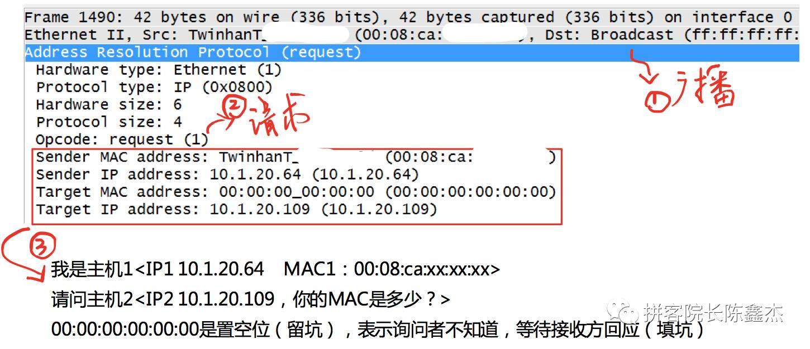

# ARP协议
- [参考链接1](https://zhuanlan.zhihu.com/p/28771785)

## 1. ARP概述
如果要在TCP/IP协议栈中选择一个"最不安全的协议"，那么我会毫不犹豫把票投给ARP协议。我们经常听到的这些术语，包括"网络扫描"、"内网渗透"、"中间人拦截"、"局域网流控"、"流量欺骗"，
基本都跟ARP脱不了干系。大量的安全工具，例如大名鼎鼎的Cain、功能完备的Ettercap、操作傻瓜式的P2P终结者，底层都要基于ARP实现。

在深入到技术原理之前，作为初学者，我们先记住下面三句话：
1. ARP（Address Resolution Protocol）即地址解析协议， 用于实现从 IP 地址到 MAC 地址的映射，即询问目标IP对应的MAC地址。

2. 在网络通信中，主机和主机通信的数据包需要依据OSI模型从上到下进行数据封装，当数据封装完整后，再向外发出。所以在局域网的通信中，不仅需要源目IP地址的封装，也需要源目MAC的封装。

3. 一般情况下，上层应用程序更多关心IP地址而不关心MAC地址，所以需要通过ARP协议来获知目的主机的MAC地址，完成数据封装。

## 2. 原理之请求应答

小结：经过上面6个步骤的处理，PC1终于把数据包发送出去了，之后便可以进行正常的通信了。看到了吧，ARP的功能和实现过程是如此的简单：
它在发送方需要目标MAC地址的时及时出手，通过"一问一答"的方式获取到特定IP对应的MAC地址，然后存储到本地【ARP缓存表】，后续需要的话，就到这里查找。

既然是"缓存"表，意味着它有时效性，并且如果电脑或者通信设备重启的话，这张表就会清空；也就是说，如果下次需要通信，又需要进行ARP请求。
在我们的windows/macos系统下，可以通过命令行"arp -a"查看具体信息

## 3. ARP原理之广播请求单播回应
ARP协议就需要采用以太网的"广播"功能：将请求包以广播的形式发送，交换机或WiFi设备（无线路由器）收到广播包时，会将此数据发给同一局域网的其他所有主机。

PC1发送的请求广播包同时被其他主机收到，然后PC3和PC4收到之后（发现不是问自己）则丢弃。而PC2收到之后，根据请求包里面的信息（有自己的IP地址），
判断是给自己的，所以不会做丢弃动作，而是返回ARP回应包。

ARP请求是通过广播方式来实现的，那么，PC2返回ARP回应包，是否也需要通过广播来实现呢？答案是否定的。大部分网络协议在设计的时候，都需要保持极度克制，
不需要的交互就砍掉，能合并的信息就合并，能不用广播就用单播，以此让带宽变得更多让网络变得更快。

那么，ARP回应包是如何处理的？这里需要特别关注ARP请求包的内容，在上面的图解里面，ARP请求包的完整信息是：我的IP地址是IP1，MAC地址是MAC1，
请问谁是PC2，你的IP2对应的MAC地址是多少？

简单来说，ARP请求首先有"自我介绍"，然后才是询问。这样的话，PC2在收到请求之后，就可以将PC1的IP和MAC映射信息存储在本地的【ARP缓存表】，
既然知道PC1在哪里，就可以返回ARP单播回应包。、

这张图我们需要得到两个信息：①被询问者PC2先生成了ARP映射信息，然后才是询问者PC1；②PC3和PC4等其他主机，无法收到这个ARP回应包，因为是单播形式。

**小结：ARP协议通过"一问一答"实现交互，但是"问"和"答"都有讲究，"问"是通过广播形式实现，"答"是通过单播形式。**

## 4. ARP数据包解读

**ARP请求包**

**ARP回应包**

**ARP协议字段解读**

Hardware type ：硬件类型，标识链路层协议

Protocol type： 协议类型，标识网络层协议

Hardware size ：硬件地址大小，标识MAC地址长度，这里是6个字节（48bti）

Protocol size： 协议地址大小，标识IP地址长度，这里是4个字节（32bit）

Opcode： 操作代码，标识ARP数据包类型，1表示请求，2表示回应

Sender MAC address ：发送者MAC

Sender IP address ：发送者IP

Target MAC address ：目标MAC，此处全0表示在请求

Target IP address： 目标IP

## 5.ARP到底是链路层还是网络层？

这个问题的难度堪比另外一个世界级难题：世界上最好的编程语言是什么？

**协议到底所属哪一层，可以从应用/功能来考虑，也可以从层次/包封装来考虑。**

以ARP协议为例，它的功能最终是获取到MAC信息，服务于链路层，从这点考虑，ARP是链路层协议；但是从层次来看，ARP基于Ethernet协议，IP协议基于Ethernet协议，
它们在Ethernet协议里面有独立的Type类型，前者是0x0806，后者是0x0800，既然ARP和IP协议"平起平坐"，那么IP是网络层，ARP难道就不是网络层？

**小结：基于功能来考虑，ARP是链路层协议；基于分层/包封装来考虑，ARP是网络层协议。（此方法对于ICMP协议同样管用）**

# RARP协议

反向地址转换协议（RARP：Reverse Address Resolution Protocol）。
允许局域网的物理机器从网关服务器的 ARP 表或者缓存上请求其 IP 地址。

## 工作原理
1. 发送主机发送一个本地的RARP广播，在此广播包中，声明自己的MAC地址并且请求任何收到此请求的RARP服务器分配一个IP地址；

2. 本地网段上的RARP服务器收到此请求后，检查其RARP列表，查找该MAC地址对应的IP地址；

3. 如果存在，RARP服务器就给源主机发送一个响应数据包并将此IP地址提供给对方主机使用；

4. 如果不存在，RARP服务器对此不做任何的响应；

5. 源主机收到从RARP服务器的响应信息，就利用得到的IP地址进行通讯；如果一直没有收到RARP服务器的响应信息，表示初始化失败。

