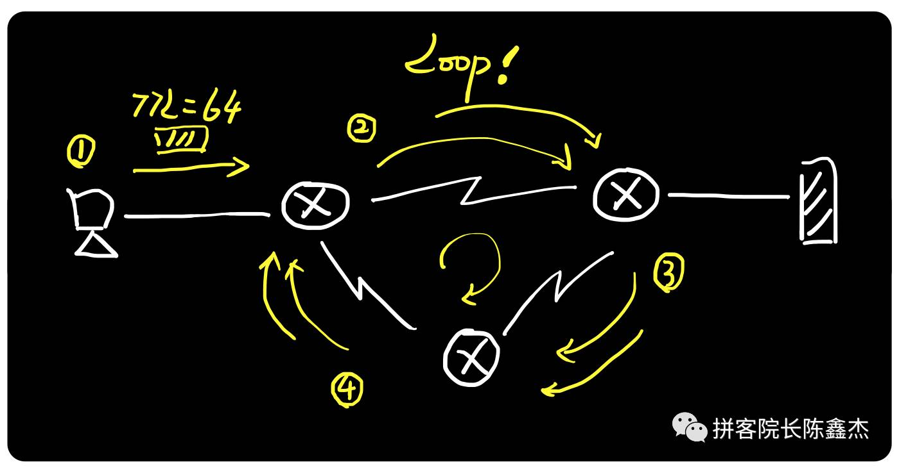
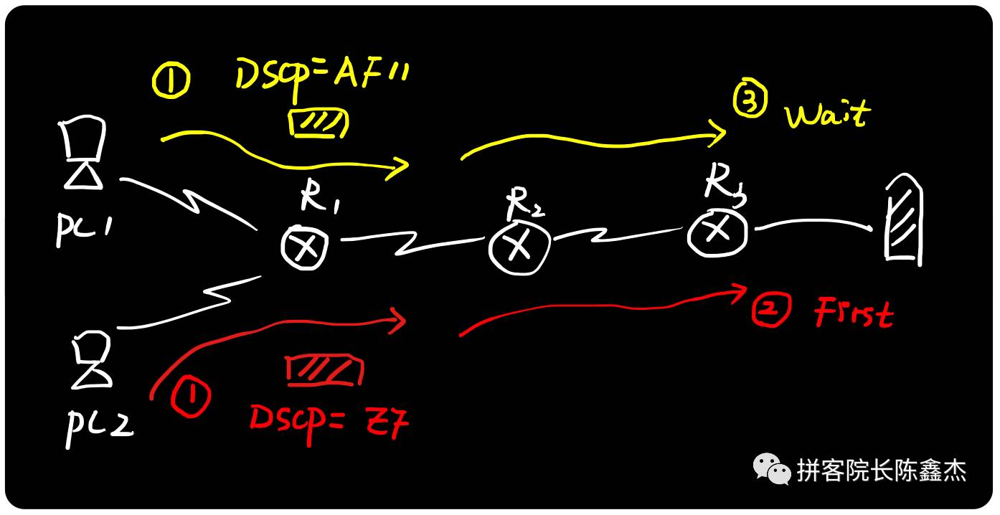
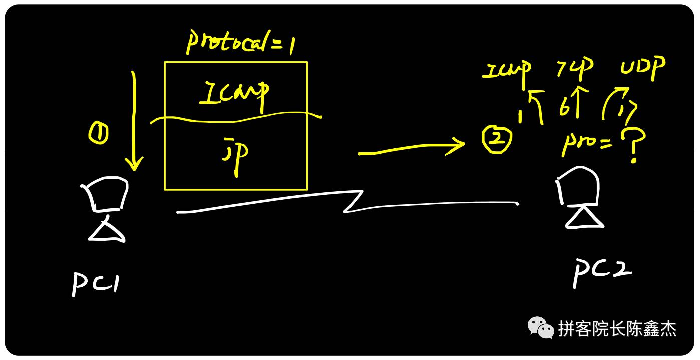

# IP协议
- [参考1](https://zhuanlan.zhihu.com/p/29287795)

## 1.IP协议原理
IP协议（Internet Protocol，互联网协议），是TCP/IP协议栈中最核心的协议之一，通过IP地址，保证了联网设备的唯一性，实现了网络通信的面向无连接和不可靠的传输功能。

1. IP协议提供了IP地址，并将源目IP地址夹带在通信数据包里面，为路由器指明通信方向；

2. IP协议只能指明数据包的源目通信方即"这是谁的送给谁的"，但不能保证数据包一定能到达对方，数据是否会被丢弃以及丢弃之后如何处理。所以，上面才有这句："IP协议提供面向无连接不可靠传输功能"。
那么，如果出现丢包且需要重传时，谁来解决呢？这就需要TCP/IP协议栈另外一个"半壁江山"来实现，大家肯定猜到了：TCP协议能解决以上这些IP协议不能实现的功能。

当然，IP协议不仅仅只有"快递单"功能，它还能防止数据包环路、为数据打上重要或不重要等标签实现流量控制、能验证数据包是否损坏、能实现数据包分片和组装功能；
而要深入学习这些功能，必须掌握IP头部的封装格式。

## 2.IP协议头部
上面提到的"快递单"即IP头部到底长得怎么样，我们可以通过抓包的方式来更加直观的认识，这里以我的电脑 Ping 谷歌DNS服务器为例子（我的电脑地址为192.168.199.152，谷歌服务器地址为8.8.8.8。）

我们可以看到IP头部默认有12个字段（后续会提到特殊字段），为了方便记忆，可以总结为7个核心知识点：
> 1. Source和Destination即IP源目地址字段，是IP协议最核心的字段
> 2. Id+Flags+FO三个字段可以实现IP数据分片和重组；
> 3. Total Length和Header Length标记IP头部和上层数据的边界；
> 4. TTL生存时间字段可以实现通信防环；
> 5. DSCP服务区分符可以实现流量控制
> 6. Checksum字段可以数据包完整性校验；
> 7. Protocol字段标记上层应用

### length长度字段解读
长度字段在大部分协议里面都会出现，例如IP、TCP、UDP协议，功能都是为了"划分界限"：哪里是头部，哪里是数据。

通过Header Length我们知道IP协议的头部是20字节（默认是20字节，最长可以是60个字节），Total Length这里标明是100个字节，所以剩下的数据部分则是80字节。

### TTL生存时间字段解读
TTL（Time to live）即生存时间，用于标识IP数据包"还能存活多久"，这个生存值在发送方发送数据时便设置好了。不同电脑/操作系统的初始TTL是不同的，
例如上图，便是我的Mac电脑发出的，默认值是64，其他一些系统是128或255。由于TTL值占用8个bit位，所以最大值是255（二进制11111111）。

IP数据包每经过一个路由器或三层设备，TTL便会被减去1，而当TTL=0的时候，则代表此数据包"死亡"，此时路由器便会向源发送者返回一个"TTL Exceed"的ICMP报错包。

TTL值除了标识IP数据包的生存值之外，另外一个特别重要的功能便是"防止数据包环路"，简称为"防环"。很多时候，由于工程师的疏忽，或者网络拓扑结构的复杂性，会出现一些有bug的网络环境, 例如:

上面便是一个经典的"环路拓扑"，当电脑将数据包发送到互联网时，由于网络设备之间存在环路（Loop），所以数据包一直在里面绕起来，而不是发送到最右边的服务器。

如果没有TTL，则这个数据包会一直存在于链路中，这样不仅占用网络带宽，并且浪费设备的处理器资源。若有大量的数据包存在网络中，则会拖垮其他人的正常通信。

而当IP数据包加入了TTL值之后，即便网络拓扑存在环路设计，**当数据包被转发到TTL为0的时候，网络设备也可以直接丢弃，以此解决环路带来的危害。**

### DSCP字段解读
虽然我们经常听到"互联网上人人平等"，但从互联网设计之初，就已经不是平等的，可以从IP头部这里的DSCP字段就可以看出来。

DSCP（Differentiated Services Field） 即服务区分符，用于为不同的IP数据包定义不同的服务质量。DSCP的前身叫做TOS（Type of Service，服务类型）。
不管是TOS还是DSCP，它们都是QoS服务质量里面的技术实现。

如上图所示，当PC1和PC2两个用户同时访问互联网时，由于数据包采用不同的DSCP值，不同的值代表了不同的优先级，例如这里的AF11和EF，可以看成一个是普通等级，
一个是VIP等级，此时VIP等级自然要优先被转发。

应用场景：**在企业网中，网络运维人员可以为核心数据流采用高优先级的DSCP值，为其他普通的例如BT下载流量采用最普通的优先级。在运营商网络里，
可以根据客户购买的不同专线服务，采用不同的DSCP值**。

### Checksum字段解读
checksum校验字段跟长度字段类似，存在于很多协议里面，用于实现数据完整性校验.

不同协议采用的方法有差异，例如IP协议的checksum值只校验IP头部，不包括数据部分，而TCP和UDP的校验则包括数据部分。

上图中，PC1发送IP数据包（含checksum1）给PC2，PC2拆开IP头部，然后进行校验计算（checksum2），若校验没问题则接收并处理，若检验有问题则丢弃。
注意，这里采用的是校验算法，不是简单的相同对比。

### Protocol字段解读
无论是IP协议的Protocol字段，还是Ethernet以太网协议里面的Type字段，又或者是TCP/UDP协议里面的Port字段，这些字段的功能都是用于标识上层协议或应用。
例如，**ICMP协议号为1，TCP协议号为6，UDP的协议号为17**。

以这里例子来看，若PC2采用TCP或UDP来解开ICMP数据包，则无法正常解析，好比用word程序要打开一部mp4电影，肯定会有故障。而如果这里PC2根据协议号为1，
调用ICMP协议来处理ICMP数据包，则可以正常解读并返回回应包。

所以，协议号（Protocol）、端口号（Port）、类型值（Type）这些的功能都是：标记上层协议/应用，告诉接收方，有正确的协议/应用来打开这个数据，
功能相当于电脑文件的后缀名，告诉电脑用哪些应用程序来打开对应的文件。

**小结**：
通过Wireshark我们抓取了IP协议头部字段，并对头部里面大部分的字段进行了解读，包括IP源目地址、长度字段、TTL值、DSCP值、协议号等，
IP分片相关字段我们在后续章节再讨论。

## 3.IP协议总结

1. IP地址是一张接入互联网的身份证，存在于电脑、手机、摄像头、汽车等任何需要联网的设备；

2. 互联网通信里数据包会被嵌入IP源目地址，类似快递收发过程中的"快递单"，通过IP地址的唯一性，保证了正常的通信。

3. IP协议不仅只有IP地址这个寻址功能，它还能防止数据包环路、实现流量控制、能验证数据包完整性、能实现数据包分片和组装。

4. 本章节中，我们通过Wireshark抓取真实网络数据包（我的电脑访问谷歌DNS服务器），并且拆分IP头部字段来进行解构。