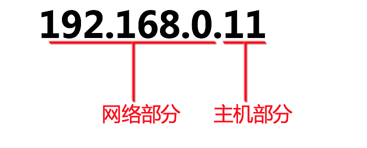
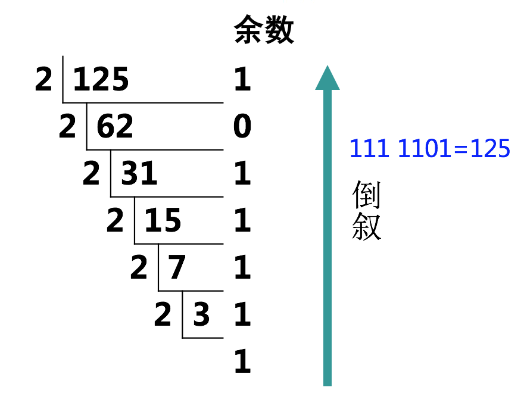
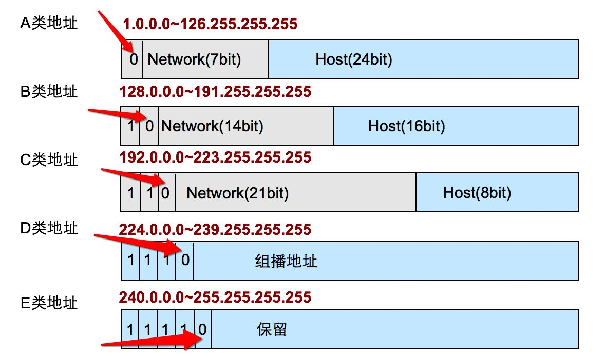
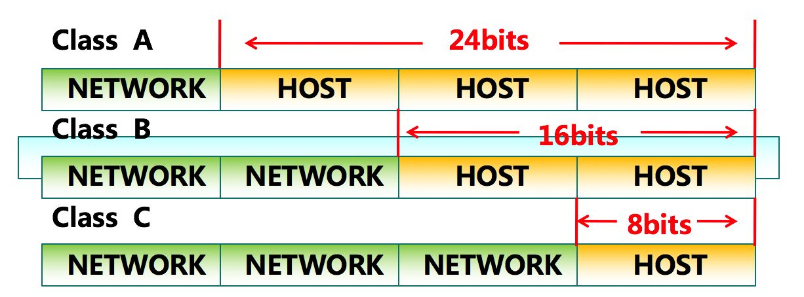
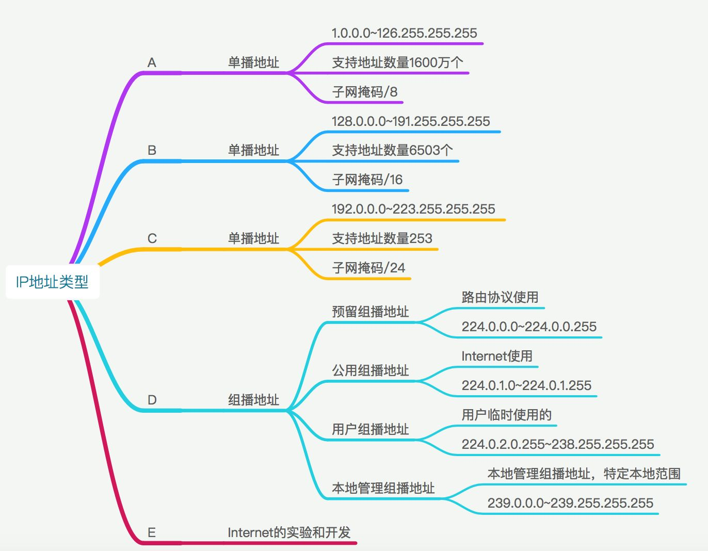
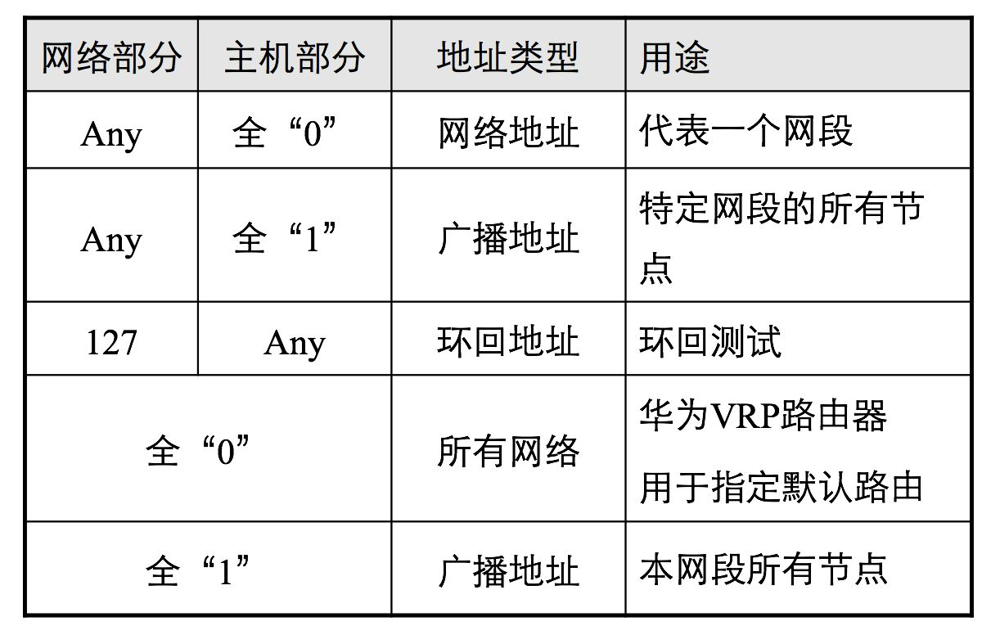
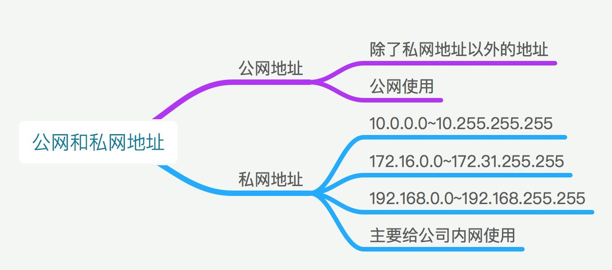

# IP地址
- [参考链接1](https://zhuanlan.zhihu.com/p/26030614)
- [参考链接2](https://blog.csdn.net/hexf9632/article/details/93469788)

## 1.简介

IP地址分为IPV4 IPV6，我们所说的的IP地址指的是IPV4的地址。

IP地址是由两部分组成的，网络部分和主机部分，比如：

网络部分如果一样，则代表在同一个网段（主机部分可以不一样）。什么叫同一个网段（同一个广播域）呢？
好比在同一房间的人一样，他们之间通讯可以基本靠吼，也就是我们所说的广播。不同网段的好比不同房间的他们之间正常情况下不能通讯。

**IP地址分为4组，8bit（8个二进制）一组，4个组组成了32个二进制。**

**二进制1111 1111转换为十进制为255**

**十进制转二进制**
将128除以2得出余数，然后一个个往下除，然后将余数倒叙进行排列

## 2.IP地址类型

**IP地址类型分为A、B、C、D、E、**

1. A、B、C类：我们生活中常用的类型的IP地址
2. D类：组播地址在路由协议的时候会讲到几个常用的几个，用户组播地址在CCIE中学习
3. E类：仅供Internet实验和开发

注：A类前一位为0，B类前两位为10（其他位任意）；C类前三位为110（其他位任意）；D类前四位为1110（其他位任意）；
E类前五位为11110（其他位任意），其中127和0开头的为特殊地址；

**A、B、C三类IP地址的组成**

网络部分（NETWORK）

主机部分（HOST）

**IP地址的范围和作用思维导图如下：**

**IP地址中的特殊地址：**

**公网地址和私网地址：**

在局域网里，同样也需要 IP 地址，一般内网的 IP 地址是以 192.168 开头的，这样很容易区分公网和内网的 IP 地址。

**有IP了为什么还要有MAC地址**
- [可参考链接](https://www.zhihu.com/question/21546408/answer/149670503)
- [参考链接2](https://www.zhihu.com/question/49335649)

总结就是 由于历史原因，最开始是使用以太网的时候使用的是MAC地址。后来有了因特网，
为了把所有网络联系起来，在上层使用了IP地址的概念。

## 3.示例
Internet 网络中，每个上网的计算机都有一个像上述例子的地址，这个地址就是 IP 地址，是分配给网络设备的门牌号，为了网络中的计算机能够互相访问，
IP 地址=网络地址+主机地址，图1中的 IP 地址是 192.168.100.1，这个地址中包含了很多含义。如下所示：

- 网络地址(相当于街道地址)：192.168.100.0
- 主机地址(相当于各户的门号)：0.0.0.1
- IP地址(相当于住户地址)：网络地址+主机地址=192.168.100.1
- 广播地址：192.168.100.255

这些地址是如何计算出来的呢？为什么计算这些地址呢？要想知道如何，先要明白一个道理，学习网络的目的就是如何让网络中的计算机相互通讯，也就是说要围绕着"通"这个字来学习和理解网络中的概念，而不是只为背几个名词。

注：192.168.100.1 是私有地址，是不能直接在 Internet 网络中应用的，上 Internet 要转为公有地址，下面详细说明。

计算网络地址就是判断网络中的计算机在不在同一网络，在就能通，不在就不能通。注意，这里说的在不在同一网络指的是 IP 地址而不是物理连接，那么如何计算呢？

**将 IP 地址和子网掩码都换算成二进制，然后进行与运算，结果就是网络地址**

### 子网掩码

子网掩码是用来判断任意两台计算机的 IP 地址是否属于同一子网络的根据。最为简单的理解就是两台计算机各自的 IP 地址与子网掩码进行 and 运算后，得出的结果是相同的，
则说明这两台计算机是处于同一个子网络上的，可以进行直接的通讯。（具体子网掩码各位的含义待补充。）

### 默认网关
如果搞清了什么是网关，默认网关也就好理解了。就好像一个房间可以有多扇门一样，一台主机可以有多个网关。默认网关的意思是一台主机如果找不到可用的网关，
就把数据包发给默认指定的网关，由这个网关来处理数据包。
现在主机使用的网关，一般指的是默认网关。

一台电脑的默认网关是不可以随随便便指定的，必须正确地指定，否则一台电脑就会将数据包发给不是网关的主机，从而无法与其他网络的主机通信。
默认网关的设定有手动设置和自动设置两种方式。

> 1. 手动设置适用于电脑数量比较少、TCP/IP 参数基本不变的情况，比如只有几台到十几台电脑。因为这种方法需要在联入网络的每台电脑上设置“默认网关”，非常费劲，
> 一旦因为迁移等原因导致必须修改默认网关的 IP 地址，就会给网管带来很大的麻烦，所以不推荐使用。
>
> 2. 自动设置就是利用 DHCP（Dynamic Host Configuration Protocol, 动态主机配置协议）服务器来自动给网络中的电脑分配 IP 地址、子网掩码和默认网关 。这样做的好处是一旦网络的默认网关发生了变化时，只要更改了 DHCP 服务器中默认网关的设置，那么网络中所有的电脑均获得了新的默认网关的 IP 地址。
> 这种方法适用于网络规模较大、TCP/IP 参数有可能变动的网络。另外一种自动获得网关的办法是通过安装代理服务器软件（如MS Proxy）的客户端程序来自动获得，其原理和方法和 DHCP 有相似之处。

### 网关

那么网关到底是什么呢？网关实质上是一个网络通向其他网络的IP地址。比如有网络A和网络B，网络A的IP地址范围为“192.168.1.1~192. 168.1.254”，子网掩码为255.255.255.0；
网络B的IP地址范围为“192.168.2.1~192.168.2.254”，子网掩码为255.255.255.0。在没有路由器的情况下，两个网络之间是不能进行TCP/IP通信的，
即使是两个网络连接在同一台交换机（或集线器）上，TCP/IP协议也会根据子网掩码（255.255.255.0）与主机的IP 地址作 “与” 运算的结果不同判定两个网络中的主机处在不同的网络里。
而要实现这两个网络之间的通信，则必须通过网关。如果网络A中的主机发现数据包的目的主机不在本地网络中，就把数据包转发给它自己的网关，再由网关转发给网络B的网关，网络B的网关再转发给网络B的某个主机。
网络A向网络B转发数据包的过程。

所以说，只有设置好网关的IP地址，TCP/IP协议才能实现不同网络之间的相互通信。那么这个IP地址是哪台机器的IP地址呢？网关的IP地址是具有路由功能的设备的IP地址，具有路由功能的设备有路由器、
启用了路由协议的服务器（实质上相当于一台路由器）、代理服务器（也相当于一台路由器）。