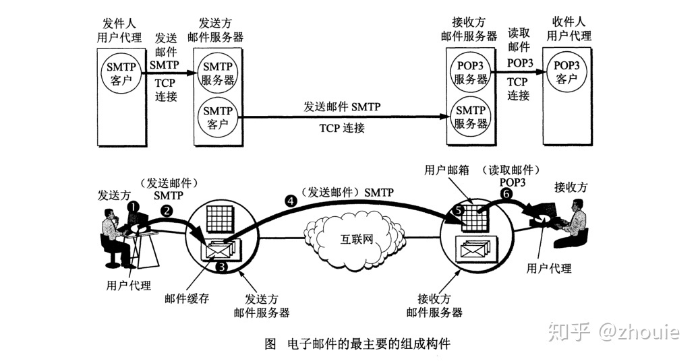
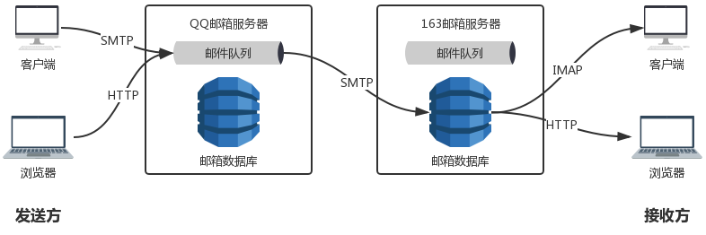

# SMTP协议

[参考链接1](https://zhuanlan.zhihu.com/p/84174651)

## 电子邮件系统的组成

## 用户代理UA(User Agent)

用户代理就是用户与电子邮件系统的接口，在大多数情况下它就是运行在用户电脑中的一个程序。**因此用户代理又称为电子邮件客户端软件。**

用户代理向用户提供一个很友好的接口（目前主要是窗口界面）来发送和接收邮件。现在可供大家选择的用户代理有很多种。例如，比较受欢迎的Outlook、Foxmail。

用户代理至少应当具有以下4个功能:

> 撰写。给用户提供编辑信件的环境。例如，应让用户能创建便于使用的通讯录（有常用的人名和地址）。回信时不仅能很方便地从来信中提取出对方地址，并自动地将此地址写入到邮件中合适的位置，而且还能方便地对来信提出的问题进行答复（系统自动将来信复制一份在用户撰写回信的窗口中，因而用户不需要再输入来信中的问题）。

> 显示。能方便地在计算机屏幕上显示出来信（包括来信附上的声音和图像)。

>处理。处理包括发送邮件和接收邮件。收件人应能根据情况按不同方式对来信进行处理。例如，阅读后删除、存盘、打印、转发等，以及自建目录对来信进行分类保存。有时还可在读取信件之前先査看一下邮件的发件人和长度等，对于不愿收的信件可直接在邮箱中删除。

> 通信。发信人在撰写完邮件后，要利用邮件发送协议发送到用户所使用的邮件服务器。收件人在接收邮件时，要使用邮件读取协议从本地邮件服务器接收邮件。

## 邮件服务器

邮件服务器的功能是发送和接收邮 件，同时还要向发件人报告邮件传送的结果（已交付、被拒绝、丢失等）。邮件服务器按照 客户服务器方式（C/S）工作。邮件服务器需要使用两种不同的协议。一种协议用于用户代理向邮件 服务器发送邮件或在邮件服务器之间发送邮件，如SMTP协议，而另一种协议用于用户代 理从邮件服务器读取邮件，如邮局协议POP3。

这里应当注意，邮件服务器必须能够同时充当客户和服务器。例如，当邮件服务器A向另一个邮件服务器B发送邮件时，A就作为SMTP客户，而B是SMTP服务器。反之，当B向A发送邮件时，B就是SMTP客户，而A就是SMTP服务器。

## 邮件发送协议
这里以简单邮件传送协议SMTP来讲:

SMTP规定了在两个相互通信的SMTP进程之间应如何交换信息。由于SMTP使用客户服务器方式，因此负责发送邮件的SMTP进程就是SMTP客户，而负责接收邮件的SMTP进程就是SMTP服务器。至于邮件内部的格式，邮件如何存储，以及邮件系统应以多快的速度来发送邮件，SMTP也都未做出规定。

发件人的邮件送到发送方邮件服务器的邮件缓存后，SMTP客户就每隔一定时间对邮件缓存扫描一次。如发现有邮件，就使用SMTP的熟知端口号码25与接收方邮件服务器的SMTP服务器**建立TCP连接。**

在连接建立后，接收方SMTP服务器要发出“220 Service ready”（服务就绪）。然后SMTP客户向SMTP服务器发送HELO命令，附上发送方的主机名。SMTP服务器若有能力接收邮件，则回答：“250 OK”，表示已准备好接收。若SMTP服务器不可用，则回答“421 Service not available”（服务不可用）。如在一定时间内发送不了邮件，邮件服务器会把这个情况通知发件人。

**SMTP不使用中间的邮件服务器。**不管发送方和接收方的邮件服务器相隔有多远，不管在邮件传送过程中要经过多少个路由器，TCP连接总是在发送方和接收方这两个邮件服务器之间直接建立。当接收方邮件服务器出故障而不能工作时，发送方邮件服务器只能等待一段时间后再尝试和该邮件服务器建立TCP连接，而不能先找一个中间的邮件服务器建立TCP连接。

## 邮件读取协议
现在常用的邮件读取协议有两个，即邮局协议第3个版本POP3和网际报文存取协议
IMAP (Internet Message Access Protocol)。
**这两个协议同样是应用层的协议**

### POP3
邮局协议POP是一个非常简单、但功能有限的邮件读取协议。邮局协议POP最初公布于1984年。经过几次更新，现在使用的是1996年的版本POP3 [RFC 1939]，它己成为互联网的正式标准。

在接收邮件的用户计算机中的用户代理必须运行POP3客户程序，而在收件人所连接的邮件服务器中则运行POP3服务器程序。当然，这个邮件服务器还必须运行SMTP服务器程序，以便接收发送方邮件服务器的SMTP客户程序发来的邮件。P0P3服务器只有在用户输入鉴别信息（用户名和口令）后，才允许对邮箱进行读取。

**POP3协议的一个特点就是只要用户从POP3服务器读取了邮件，POP3服务器就把该邮件删除。**这在某些情况下就不够方便。例如，某用户在办公室的台式计算机上接收了一个邮件，还来不及写回信，就马上携带笔记本电脑出差。当他打开笔记本电脑写回信时，POP3服务器上却己经删除了原来己经看过的邮件（除非他事先将这些邮件复制到笔记本电脑中）。**为了解决这一问题，POP3进行了一些功能扩充，其中包括让用户能够事先设置邮件读取后仍然在POP3服务器中存放的时间[RFC2449]。目前RFC2449是互联网建议标准。**

### IMAP
另一个读取邮件的协议是网际报文存取协议IMAP，它比POP3复杂得多。**IMAP和POP都按客户服务器方式工作，但它们有很大的差别。**现在较新的版本是2003年3月修订的版本4，即IMAP4[RFC3501]，它目前也是互联网的建议标准。不过在习惯上，对这个协议大家很少加上版本号“4”，而经常简单地用IMAP表示IMAP4。但是对POP3却不会忘记写上版本号“3"。

在使用IMAP时，在用户的计算机上运行IMAP客户程序，然后与接收方的邮件服务器上的IMAP服务器程序建立TCP连接。用户在自己的计算机上就可以操纵邮件服务器的邮箱，就像在本地操纵一样，**因此IMAP是一个联机协议**。

当用户计算机上的IMAP客户程序打开IMAP服务器的邮箱时，用户就可看到邮件的首部。若用户需要打开某个邮件，则该邮件才传到用户的计算机上.

IMAP最大的好处就是用户可以在不同的地方使用不同的计算机（例如，使用办公室的计算机、或家中的计算机，或在外地使用笔记本电脑）随时上网阅读和处理自己在邮件服务器中的邮件。IMAP还允许收件人只读取邮件中的某一个部分。

IMAP的缺点是如果用户没有将邮件复制到自己的计算机上，则邮件一直存放在IMAP服务器上。要想查阅自己的邮件，必须先上网。

## 基于万维网的电子邮件
从前面的图可看出，用户要使用电子邮件，必须在自己使用的计算机中安装用户代理软件UA。如果外出到某地而又未携带自己的笔记本电脑，那么要使用别人的计算机进行电子邮件的收发，将是非常不方便的。

现在这个问题解决了。在20世纪90年代中期，Hotmail推出了基于万维网的电子邮件(Webmail)。今天，几乎所有的著名网站以及大学或公司，都提供了万维网电子邮件。常用的万维网电子邮件有谷歌的Gmail，微软的Hotmail，雅虎的Yahoo Mail。网易的163或126、新浪的sina等互联网技术公司也都提供万维网邮件服务。

万维网电子邮件的好处就是：不管在什么地方，只要能够找到上网的计算机，在打开任何一种浏览器后，就可以非常方便地收发电子邮件。**使用万维网电子邮件不需要在计算机中再安装用户代理软件。**浏览器本身可以向用户提供非常友好的电子邮件界面（和原来的用户代理提供的界面相似），使用户在浏览器上就能够很方便地撰写和收发电子邮件。

## 补充与思考
1. 前面的知识告诉我们，有两种不同的通信方式：“推”（push)：SMTP客户把邮件“推”给SMTP服务器。“拉”（pull)：POP3客户把邮件从POP3服务器“拉”过来。

    如果让邮件服务器程序就在发送方和接收方的计算机中运行，那么岂不是可以直接把邮件发送到收件人的计算机中？

    答案是“不行”。这是因为并非所有的计算机都能运行邮件服务器程序。

2. 虽然SMTP使用TCP连接试图使邮件的传送可靠，但“发送成功”并不等于“收件人读取了这个邮件”。

3. 经广泛使用多年的SMTP存在着一些缺点。

为了解决上述问题，2008年10月颁布的RFC 5321对SMTP进行了扩充，成为扩充的SMTP（Extended SMTP）,记为ESMTP。RFC 5321在许多命令中增加了扩展的参数。新增加的功能有：客户端的鉴别，服务器接受二进制报文，服务器接受分块传送的大报文，发送前先检査报文的大小，使用安全传输TLS，以及使用国际化地址等。

考虑到现在的许多SMTP邮件服务器可能还没有升级到ESMTP，因此特规定使用ESMTP的客户端在准备传送报文时，不是发送HELO而是发送EHLO报文。**如果EHLO报文被对方服务器端拒绝，就表明对方仍然是一个标准的SMTP邮件服务器（不使用扩展的参数），因而就要按照原来使用的SMTP参数进行邮件的传送。如果EHLO报文被接受了，那么客户端就可以使用ESMTP扩展的参数传送报文了。**

### 补充图
