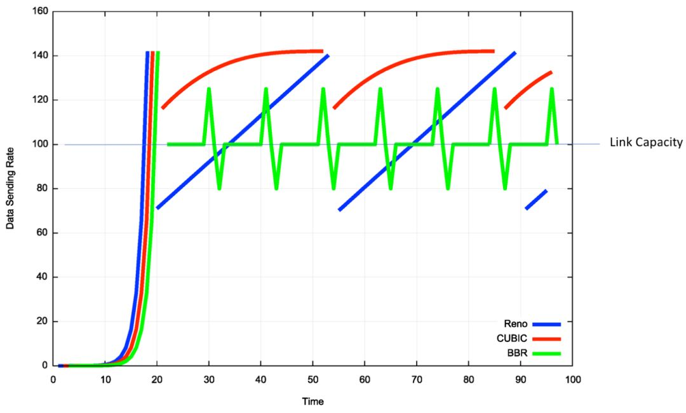

# TCP/IP五层模型
- [参考文章](https://www.cnblogs.com/qishui/p/5428938.html)
- [参考文章2](https://blog.csdn.net/zhang6223284/article/details/81414149)
- [参考文章3](https://zhuanlan.zhihu.com/p/76023663)
- [参考文章4](https://blog.csdn.net/gx17864373822/article/details/105353832/)

## 什么是TCP/IP、UDP？
TCP/IP五层协议和OSI的七层协议对应关系: TCP/IP中应用层 对应 OSI 中的 应用层+表示层+运输层，其他为 传输层、网络层、数据链路层、物理层。

TCP/IP（Transmission Control Protocol/Internet Protocol）即传输控制协议/网间协议，是一个工业标准的协议集，它是为广域网（WANs）设计的。

UDP（User Data Protocol，用户数据报协议）是与TCP相对应的协议。它是属于TCP/IP协议族中的一种

> DNS、TFTP、SNMP、NTP等（基于UDP)
>
> HTTP、FTP、SMTP、Telnet、SSH等（基于TCP）

TCP/IP协议族包括应用层、运输层、网络层、链路层。

- 应用层

    - 功能：文件传输、电子邮件、文件服务、虚拟终端等
    - HTTP、FTP、SMTP、Telnet、DNS等
    
    
    
- 传输层
    
    - 功能：提供端到端的接口
    - TCP、UDP

- 网络层

    - 功能：为数据包选择路由
    - IP、ICMP、OSPF、BGP、IGMP、

- 数据链路层

    - 功能：传输有地址的帧以及错误检测

## TCP和UDP的区别
- TCP是面向连接的，UDP是面向无连接的
- UDP程序结构比较简单
- TCP是面向字节流的，UDP是基于数据包的
- TCP保证数据传输的正确性，UDP可能丢包
- TCP保证数据顺序，UDP不保证

***
## UDP
- 数据包头

        源端口号(16位)    目的端口号(16位)
        UDP长度(16位)     UDP校验和(16位)
                    数据

- UDP的特点

    - 沟通简单
    - 轻信他人，即它不会建立连接，但是会通过监听的方式，可以与任何人之间传输数据，可同时向多人传输数据
    - 不会变通，即不会根据网络的情况进程拥塞控制

- UDP的主要应用场景

    - 需要资源少，网络稳定的内网，或者对于丢包不敏感的应用，比如DHCP就是基于UDP协议的
    - 不需要一对一沟通，建立连接，而是可以广播的应用。因为它不面向连接，所以可以做到一对多，承担广播或者多播的协议
    - 需要处理速度快，可以容忍丢包，但是即使网络拥塞，也毫不退缩，一往无前

- UDP的例子

    - 直播：直播对实时性的要求比较高，宁可丢包，也不要卡顿的，所以很多直播应用都基于 UDP 实现了自己的视频传输协议
    - 实时游戏。游戏的特点也是实时性比较高，在这种情况下，采用自定义的可靠的 UDP 协议，自定义重传策略，能够把产生的延迟降到最低，减少网络问题对游戏造成的影响
    - 物联网。一方面，物联网领域中断资源少，很可能只是个很小的嵌入式系统，而维护 TCP 协议的代价太大了；另一方面，物联网对实时性的要求也特别高。比如 Google 旗下的 Nest 简历 Thread Group，推出了物联网通信协议 Thread，就是基于 UDP 协议的

***
## TCP

- TCP包头格式

    - 可见原文

- 包头中的内容分别有什么用

    - 源端口和目标端口是必不可少的
    - 包的序号：主要是为了解决乱序的问题
    - 确认序号：发出去的包需要有确认信息，才能知道对方是否收到，如果没有收到需要重新发送，即解决了不丢包的问题
    - 状态位：SYN是发起一个链接，ACK是回复确认信息，RST是重新连接，FIN是结束连接。由于TCP是面向连接的，所以需要双方维护连接的状态，而这些状态位的包会引起双方的状态变更
    - 窗口大小：TCP要做系统控制，需要通信双方各声明一个窗口，标识自己的当前处理能力

- TCP中重点关注的问题

    - 顺序问题
    - 丢包问题
    - 连接维护
    - 流量控制
    - 拥塞控制

### TCP三次握手
1. 刚开始的时候，客户端和服务器都处于 CLOSED 状态，先是服务端主动监听某个端口，处于 LISTEN 状态

2. 然后客户端主动发起连接 SYN，之后处于 SYN-SENT 状态。服务端接收了发起的连接，返回 SYN，并且 ACK ( 确认 ) 客户端的 SYN，之后处于 SYN-SENT 状态

3. 客户端接收到服务端发送的 SYN 和 ACK 之后，发送 ACK 的 ACK，之后就处于 ESTAVLISHED 状态，因为它一发一收成功了

4. 服务端收到 ACK 的 ACK 之后，也处于 ESTABLISHED 状态，因为它也一发一收了。

**为什么需要三次握手**
> 举例：已失效的连接请求报文段
> 1. client发送了第一个连接的请求报文，但是由于网络不好，这个请求没有立即到达服务端，而是在某个网络节点中滞留了，直到某个时间才到达server。
本来这已经是一个失效的报文，但是server端接收到这个请求报文后，还是会想client发出确认的报文，表示同意连接
> 2. 假如不采用三次握手，那么只要server发出确认，新的建立就连接了，但其实这个请求是失效的请求，client是不会理睬server的确认信息，
>也不会向服务端发送确认的请求。但是server认为新的连接已经建立起来了，并一直等待client发来数据，这样，server的很多资源就没白白浪费掉了。
> 3. 采用三次握手就是为了防止这种情况的发生，server会因为收不到确认的报文，就知道client并没有建立连接。这就是三次握手的作用。

#### 三次握手过程中有哪些不安全性
1. SYN flood 泛洪攻击：
> 伪装的IP向服务器发送一个SYN请求建立连接，然后服务器向该IP回复SYN和ACK，但是找不到该IP对应的主机，当超时时服务器收不到ACK会重复发送。当大量的攻击者请求建立连接时，服务器就会存在大量未完成三次握手的连接，服务器主机backlog被耗尽而不能响应其它连接。

防范措施：
> 1. 降低SYN timeout时间，使得主机尽快释放半连接的占用
> 2. 采用SYN cookie设置，如果短时间内连续收到某个IP的重复SYN请求，则认为受到了该IP的攻击，丢弃来自该IP的后续请求报文 
> 3. 在网关处设置过滤，拒绝将一个源IP地址不属于其来源子网的包进行更远的路由 

2. Land 攻击
> 局域网拒绝服务攻击，英语：Local Area Network Denial attack，缩写：LAND attack.
> 是拒绝服务攻击（DoS攻击）的一种，通过发送精心构造的、具有相同源地址和目标地址的欺骗数据包，致使缺乏相应防护机制的目标设备瘫痪。
>
> 原理：这种攻击方式采用了特别构造的TCP SYN数据包（通常用于开启一个新的连接），使目标机器开启一个源地址与目标地址均为自身IP地址的空连接，持续地自我应答，消耗系统资源直至崩溃。这种攻击方法与SYN洪泛攻击并不相同

### TCP四次挥手
- 图可参见原文

- 简单理解如下：

        A：B 啊，我不想玩了
        B：哦，你不想玩了啊，我知道了
        这个时候，只是 A 不想玩了，即不再发送数据，但是 B 可能还有未发送完的数据，所以需要等待 B 也主动关闭。
        B：A 啊，好吧，我也不玩了，拜拜
        A：好的，拜拜
    
1. 断开的时候，当 A 说不玩了，就进入 FIN_WAIT_1 的状态，B 收到 A 不玩了的消息后，进入 CLOSE_WAIT 的状态

2. A 收到 B 说知道了，就进入 FIN_WAIT_2 的状态，如果 B 直接跑路，则 A 永远处与这个状态。TCP 协议里面并没有对这个状态的处理，但 Linux 有，可以调整 tcp_fin_timeout 这个参数，设置一个超时时间

3. 如果 B 没有跑路，A 接收到 B 的不玩了请求之后，从 FIN_WAIT_2 状态结束，按说 A 可以跑路了，但是如果 B 没有接收到 A 跑路的 ACK 呢，就再也接收不到了，所以这时候 A 需要等待一段时间，因为如果 B 没接收到 A 的 ACK 的话会重新发送给 A，所以 A 的等待时间需要足够长

**为什么要四次挥手**
> 为了确保数据能够完成传输
> 1. 关闭连接时，当收到对方的FIN报文通知时，它仅仅表示对方没有数据发送给你了；
>但未必你所有的数据都全部发送给对方了。所以你未必会马上关闭SOCKET,也即你可能还需要发送一些数据给对方之后，再发送FIN报文给对方来表示你同意现在可以关闭连接了，所以它这里的ACK报文和FIN报文多数情况下都是分开发送的。

### 2.3 累计确认

### TCP 如何保证可靠传输

- 首先为了保证顺序性，每个包都有一个ID。在建立连接的时候会商定起始 ID 是什么，然后按照 ID 一个个发送，为了保证不丢包，需要对发送的包都要进行应答，当然，这个应答不是一个一个来的，而是会应答某个之前的 ID，表示都收到了，这种模式成为累计应答或累计确认。

- 为了记录所有发送的包和接收的包，TCP 需要发送端和接收端分别来缓存这些记录，发送端的缓存里是按照包的 ID 一个个排列，根据处理的情况分成四个部分

    - 发送并且确认的
    - 发送尚未确定的
    - 没有发送等待发送的
    - 没有发送并且暂时不会发送的

- 这里的第三部分和第四部分就属于流量控制的内容
- 在 TCP 里，接收端会给发送端报一个窗口大小，叫 Advertised window。这个窗口应该等于上面的第二部分加上第三部分，超过这个窗口，接收端做不过来，就不能发送了
    - 图可见原文

- 对于接收端来讲，它的缓存里面的内容要简单一些

    - 接收并且确认过的
    - 还没接收，但是马上要接收的
    - 还没接收，并且无法接收的

- 对应的数据结构如下
    - 图可见原文

***
## 2.4 顺序问题和丢包问题
- 结合上面的图看，在发送端，1、2、3 已发送并确认；4、5、6、7、8、9 都是发送了还没确认；10、11、12 是还没发出的；13、14、15 是接收方没有空间，不准备发的。

- 在接收端来看，1、2、3、4、5 是已经完成 ACK 但是还没读取的；6、7 是等待接收的；8、9 是已经接收还没有 ACK 的。

- 发送端和接收端当前的状态如下：

    - 1、2、3 没有问题，双方达成了一致
    - 4、5 接收方说 ACK 了，但是发送方还没收到
    - 6、7、8、9 肯定都发了，但是 8、9 接收方已经收到了，6、7 没有收到(即8 9先到了)，出现了乱序，缓存着但是没办法 ACK。

- 根据这个例子可以知道顺序问题和丢包问题都有可能存在，所以我们先来看确认与重传机制。

**确认与重传机制**
- 假设 4 的确认收到了，5 的 ACK 丢了，6、7 的数据包丢了，该怎么办？

- 一种方法是**超时重试**，即对每一个发送了但是没有 ACK 的包设定一个定时器，超过了一定的事件就重新尝试。这个时间必须大于往返时间，但也不宜过长，否则超时时间变长，访问就变慢了。

- 如果过一段时间，5、6、7 都超时了就会重新发送。接收方发现 5 原来接收过，于是丢弃 5；6 收到了，发送 ACK，要求下一个是 7，7 不幸又丢了。

- 当 7 再次超时的时候，TCP 的策略是超时间隔加倍。每当遇到一次超时重传的时候，都会讲下一次超时时间间隔设为先前值的两倍。

- 超时重传的机制是超时周期可能相对较长，是否有更快的方式呢？

- 有一个**快速重传**的机制，即当接收方接收到一个序号大于期望的报文段时，就检测到了数据流之间的间隔，于是发送三个冗余的 ACK，客户端接收到之后，知道数据报丢失，于是重传丢失的报文段。

- 例如，接收方发现 6、8、9 都接收了，但是 7 没来，所以肯定丢了，于是发送三个 6 的 ACK，要求下一个是 7。客户端接收到 3 个，就会发现 7 的确又丢了，不等超时，马上重发。

***
## 2.5 流量控制的问题
- 在流量控制的机制里面，在对于包的确认中，会携带一个窗口的大小

- 简单的说一下就是接收端在发送 ACK 的时候会带上缓冲区的窗口大小，但是一般在窗口达到一定大小才会更新窗口，因为每次都更新的话，刚空下来就又被填满了

***
## 2.6 拥塞控制的问题
- 也是通过窗口的大小来控制的，但是检测网络满不满是个挺难的事情，所以 TCP 发送包经常被比喻成往水管里灌水，所以拥塞控制就是在不堵塞，不丢包的情况下尽可能的发挥带宽。

- 水管有粗细，网络有带宽，即每秒钟能发送多少数据；水管有长度，端到端有时延。理想状态下，水管里面的水 = 水管粗细 * 水管长度。对于网络上，通道的容量 = 带宽 * 往返时延。

- 如果我们设置发送窗口，使得发送但未确认的包为通道的容量，就能撑满整个管道。

- 图见原文：

- 如图所示，假设往返时间为 8 秒，去 4 秒，回 4 秒，每秒发送一个包，已经过去了 8 秒，则 8 个包都发出去了，其中前四个已经到达接收端，但是 ACK 还没返回，不能算发送成功，5-8 后四个包还在路上，还没被接收，这个时候，管道正好撑满，在发送端，已发送未确认的 8 个包，正好等于带宽，也即每秒发送一个包，也即每秒发送一个包，乘以来回时间 8 秒。

- 如果在这个基础上调大窗口，使得单位时间可以发送更多的包，那么会出现接收端处理不过来，多出来的包会被丢弃，这个时候，我们可以增加一个缓存，但是缓存里面的包 4 秒内肯定达不到接收端，它的缺点会增加时延，如果时延达到一定程度就会超时重传。

- TCP 拥塞控制主要来避免两种现象，包丢失和超时重传，一旦出现了这些现象说明发送的太快了，要慢一点。

- 具体的方法就是发送端慢启动，比如倒水，刚开始倒的很慢，渐渐变快。然后设置一个阈值，当超过这个值的时候就要慢下来

- 慢下来还是在增长，这时候就可能水满则溢，出现拥塞，需要降低倒水的速度，等水慢慢渗下去。

- 拥塞的一种表现是丢包，需要超时重传，这个时候，采用快速重传算法，将当前速度变为一半。所以速度还是在比较高的值，也没有一夜回到解放前。

### 拥塞控制机制
四种拥塞控制算法：
1. 慢开始
2. 拥塞控制
3. 快重传
4. 快恢复

**什么是 TCP 拥塞控制**
>TCP 拥塞控制的目标是最大化利用网络上瓶颈链路的带宽

为了保证水管不会爆管，TCP 维护一个拥塞窗口cwnd（congestion window），用来估计在一段时间内这条链路（水管中）
可以承载和运输的数据（水）的数量，拥塞窗口的大小取决于网络的拥塞程度，并且动态地在变化，但是为了达到最大的传输效率，
我们该如何知道这条水管的运送效率是多少呢？

一个简单的方法就是不断增加传输的水量，直到水管破裂为止（对应到网络上就是发生丢包），用 TCP 的描述就是：
>只要网络中没有出现拥塞，拥塞窗口的值就可以再增大一些，以便把更多的数据包发送出去，但只要网络出现拥塞，拥塞窗口的值就应该减小一些，以减少注入到网络中的数据包数。

##### 常见的 TCP 拥塞控制算法
本文将例举目前 Linux 内核默认的 Reno 算法和 Google 的 BBR 算法进行说明，其中基于丢包的拥塞控制算法 Reno 由于非常著名，
所以常常作为教材的重点说明对象。

##### Reno
Reno 被许多教材（例如：《计算机网络——自顶向下的方法》）所介绍，适用于低延时、低带宽的网络，它将拥塞控制的过程分为四个阶段：慢启动、拥塞避免、快重传和快恢复，对应的状态如下所示：

1.慢启动阶段思路是不要一开始就发送大量的数据，先探测一下网络的拥塞程度，也就是说由小到大逐渐增加拥塞窗口的大小，在没有出现丢包时
**每收到一个 ACK 就将拥塞窗口大小加一**（单位是 MSS，最大单个报文段长度），每轮次发送窗口增加一倍，呈指数增长，
若出现丢包，则将**拥塞窗口减半**，进入拥塞避免阶段；

2. 当窗口达到慢启动阈值或出现丢包时，进入拥塞避免阶段，**窗口每轮次加一，呈线性增长**；
当收到对一个报文的**三个重复的 ACK 时**，认为这个报文的下一个报文丢失了，进入快重传阶段，要求接收方在收到一个失序的报文段后就立即发出重复确认
（为的是使发送方及早知道有报文段没有到达对方，可提高网络吞吐量约20%）
而不要等到自己发送数据时捎带确认；

3. 快重传完成后进入快恢复阶段，将慢启动阈值修改为当前拥塞窗口值的一半，同时拥塞窗口值等于慢启动阈值，
然后进入拥塞避免阶段，重复上述过程。

#### BBR
> BBR 是谷歌在 2016 年提出的一种新的拥塞控制算法，
>已经在 Youtube 服务器和谷歌跨数据中心广域网上部署，
>据 Youtube 官方数据称，部署 BBR 后，
>在全球范围内访问 Youtube 的延迟降低了 53%，
>在时延较高的发展中国家，延迟降低了 80%。

BBR 算法不将出现丢包或时延增加作为拥塞的信号，而是认为当网络上的数据包总量大于
瓶颈链路带宽和时延的乘积时才出现了拥塞，所以 BBR 也称为基于拥塞的拥塞控制算法（Congestion-Based Congestion Control），
其适用网络为高带宽、高时延、有一定丢包率的长肥网络，可以有效降低传输时延，
并保证较高的吞吐量，与其他两个常见算法发包速率对比如下：

BBR 算法周期性地探测网络的容量，交替测量一段时间内的带宽极大值和时延极小值，将其乘积作为作为拥塞窗口大小，
使得拥塞窗口始的值始终与网络的容量保持一致。
> 时延是指一个报文或分组从一个网络的一端传送到另一个端所需要的时间。它包括了发送时延，传播时延，处理时延，排队时延。（时延=发送时延+传播时延+处理时延+排队时延）一般，
> 发送时延与传播时延是我们主要考虑的。对于报文长度较大的情况，发送时延是主要矛盾；报文长度较小的情况，传播时延是主要矛盾。

所以 BBR 算法解决了两个比较主要的问题：
1. 在有一定丢包率的网络链路上充分利用带宽。
适合高延迟、高带宽的网络链路。

2. 降低网络链路上的 buffer 占用率，从而降低延迟。
适合慢速接入网络的用户。

